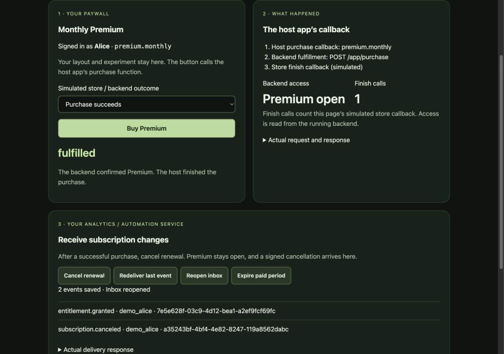

# Verify the connection, then verify your project

The example is a working reference for checking an implementation. Implement the
connection in the user's existing project, run the reference checks separately,
then test the same outcomes against the user's code. Report both results.

## For the coding assistant

1. Read the [integration brief](https://openiap.dev/commerce-example/integration-brief.md)
   and the guide for the user's role. Inspect the existing login, purchase flow,
   product model, services, and tests. Confirm missing product choices.
2. Implement only the connection the user needs. Keep their UI and experiments.
   The host app calls the store; its authenticated backend selects the user,
   verifies and binds the purchase, and reads access. Server credentials stay
   on that backend. An analytics service receives signed server events.
3. Download the [verified example source](./experience-source.tar.gz)
   into a **separate temporary directory**. Extract it and run the commands below.
   Read the relevant adapter and tests; do not copy fixture authentication or
   simulated store evidence into a production integration.
4. Run equivalent checks against the changed code in the user's project. Keep
   failed results, fix the cause, and rerun. Show changed files, exact commands,
   actual outputs, and anything not tested. Show the user's running app or service.

If a reference cannot be opened, request its contents. Do not guess it. Passing
the example's tests alone is not completion of the user's implementation.

## Reproduce this reference run

Install Bun (tested with 1.3.13) and Node.js/npm (22.22.0 / 11.17.0). Download and
extract the source above, enter its folder, and run:

```sh
npm ci
npm test
npm run demo:experience
```

The terminal prints `Paywall connection demo: http://127.0.0.1:5184`.
Open that URL. Choose a simulated result and click **Buy Premium**. After a
successful purchase, use **Cancel renewal**, **Redeliver last event**,
**Reopen inbox**, and **Expire paid period**, in that order.

These buttons exercise existing code. They do not invoke AI. Restart the command
for fresh data; use `COMMERCE_EXPERIENCE_PORT=5185 npm run demo:experience` if needed.

## What passed

| Action | Observed result | Check in the source archive |
| --- | --- | --- |
| Pending / customer cancels / store fails | No backend fulfillment; zero finish calls; Premium locked | `composition/experience.test.mjs` |
| Backend denies access | Failed result; zero finish calls; Premium locked | `composition/purchase-flow.test.mjs` |
| Successful purchase | Alice gets Premium; one finish call | `composition/experience.test.mjs` |
| Cancel renewal | Premium remains open; grant and cancellation events saved | `composition/experience.test.mjs` |
| Redeliver, then reopen inbox | Duplicate acknowledged; the same two events remain | `composition/experience.test.mjs` |
| Expire paid period | Premium locks; expiry and access-revoked events saved | `composition/experience.test.mjs` |
| Wrong owner / deletion racing fulfillment | Access and account deletion rules enforced | `verify.mjs`, `composition/app-backend.test.mjs` |
| Tampered signatures / distinct emitters | Invalid messages rejected; identities scoped to emitter | `composition/receiver.test.mjs`, `consumer.mjs` |

`npm test` passed **229 backend checks plus 5 tests / 76 assertions**. Additional
runs passed: `npm run demo:bridge` (16 checks), `npm run demo:consumer` (24 checks),
and `npm run test:tooling` (5 tests). These counts are separate suites, not a
count of unique behaviors.

The CLI command `npx --yes @hyodotdev/openiap init --role experience` also ran
successfully in the extracted project. It printed the role-specific brief and
exited; all source file hashes stayed unchanged. Copy that output into the
coding assistant's chat input for the project you want changed, append the
implementation request, and send the message.

[Actual command outputs, UI observations, and source hashes](./experience-verification.json)
include failed attempts and their corrections.



[Mobile verification screenshot](./experience-mobile.png)

## A real failure and its fix

The host adapter previously returned `fulfilled` and called `finish` when its
backend returned `{ "access": false }`. A regression test reproduced that bug.
The adapter now requires `productIds` to include the selected product before
finishing. Denied, missing, malformed, or unrelated access yields `failed` and
zero finish calls. The clean-source run passed after the fix.

The browser check also found a long delivery response overflowing a 390px mobile
screen. The screen now shows a short result with the actual JSON in a disclosure.
Desktop (1280px) and mobile (390px) checks found no horizontal overflow afterward.
This was an AI reader simulation and browser test, not a human user study.

## Source and scope

This archive extends example commit `f23f663e4220abdd709ab4cb340798d5c468cd4c`
with the adapter fix, regression tests, and a verification screen. Use the linked
archive to reproduce this record; the GitHub main branch may contain an earlier
example. The JSON report records the archive and every source file's SHA-256.
The installed contract remains `openiap-commerce-protocol@0.1.0` for this snapshot.

The screen reuses `composition/purchase-flow.mjs`, `composition/app-backend.mjs`,
the SQLite provider, and the signed event receiver. `composition/experience.mjs`
wires them together; `composition/experience.html` lets a reader inspect them.
The connection was implemented and repaired with AI in the existing example,
then independently extracted and rerun. This is not a one-prompt build from an
empty project and does not prove arbitrary prompts always produce correct code.

The corresponding IAPKit replacement check in
[`run-commerce-interop.mjs`](https://github.com/hyodotdev/openiap/blob/main/packages/kit/scripts/docs/run-commerce-interop.mjs)
asserts that the app backend returns the selected product in `productIds`.
This fix applies that condition at the host's finish boundary. IAPKit was not
started for this run; earlier compatibility reports remain separate.

HTTP, SQLite, and signature verification execute locally. Store responses,
Alice's session, and the clock are fixtures. Inbox reopening uses the same
process. This run does not verify a real store purchase, a mobile SDK checkout,
external product integrations, revenue reports, production reliability, or full protocol conformance.
Test the user's actual login, provider, device, and store sandbox separately.

The current reference bundle has a documentation-only wording correction. Its implementation is unchanged and `npm ci` / `npm test` were rerun successfully. [Distribution hashes and rerun output](https://openiap.dev/commerce-example/experience-verification.json) preserve the original archive hash; earlier input hashes remain the historical download record.
