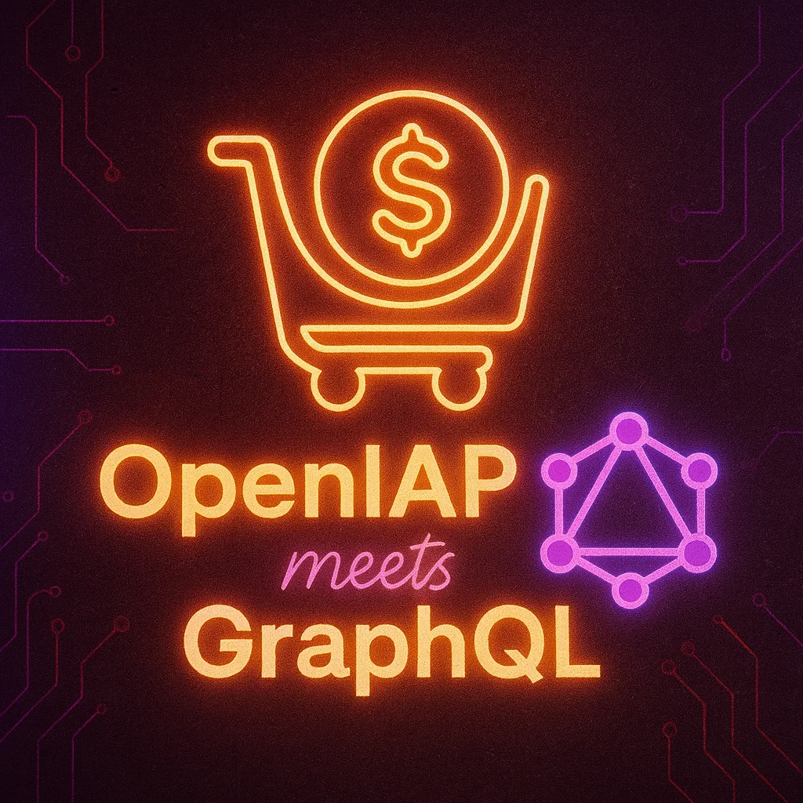

# openiap-gql Code Generation Guide

<!-- markdownlint-disable MD033 -->

  
  
   
  <strong>OpenIAP meets GraphQL</strong>

<!-- markdownlint-enable MD033 -->

_Unified schema and multiplatform codegen toolkit for OpenIAP._

This repository is the single source of truth for the OpenIAP GraphQL schema. The SDL
files live in `src/` and are split into common (`type.graphql`, `api.graphql`), error
taxonomy (`error.graphql`), and platform-specific (`*-ios.graphql`, `*-android.graphql`)
definitions.

The repository-owned generator is the only supported generation path for
TypeScript, Swift, Kotlin, Dart, GDScript, and C#. It understands OpenIAP's
code-generation SDL extensions (including nested union wrappers and comment
markers), validates their ownership, and keeps every published SDK copy in
sync. Update the schema files first, then run `bun run generate`.

TypeScript uses graphql-codegen followed by guarded AST post-processing. The
other five outputs use the strict parser, shared IR transformer, and language
plugins under `codegen/`. Both paths consume the same schema inventory,
marker/deprecation metadata, and typed custom-input contracts. Platform copies
are distributed through `generated-sync-manifest.mjs`; do not add a second
copy list or generator entrypoint.

`# => Union` is a closed wrapper contract: it may only annotate a non-root
object with one or more nullable result fields. Invalid owners, empty wrappers,
and required fields stop every language generator.

Generated outputs:

- `src/generated/types.ts` — TypeScript
- `src/generated/Types.swift` — Swift
- `src/generated/Types.kt` — Kotlin
- `src/generated/types.dart` — Dart
- `src/generated/types.gd` — GDScript
- `src/generated/Types.cs` — C# / .NET MAUI

---

## TypeScript

Uses [`@graphql-codegen/cli`](https://www.the-guild.dev/graphql/codegen).

1. Install the repository-pinned Bun version.
2. Install dependencies once from the monorepo root: `bun install --frozen-lockfile`
3. Run the complete canonical pipeline: `bun run generate`
4. Generated TypeScript output: `src/generated/types.ts`

Configuration lives in `codegen.ts`. The script merges every SDL file and
emits a schema-first type layer that mirrors the documented shapes.
`generate:ts` remains an internal diagnostic stage of the complete command;
do not commit its partial output without the final native generation and
manifest sync stages.

---

## Workflow Tips

- Treat the SDL files in `src/` as the canonical schema. Commit schema updates
  before shipping generated code.
- Do not feed the SDL directly to general-purpose GraphQL client generators.
  `ProductOrSubscription` intentionally composes generated union wrappers, so
  the SDL is an OpenIAP code-generation DSL rather than a portable executable
  GraphQL service schema.
- Regenerate with `bun run generate` whenever you change schema shape,
  generator code, or operations. The `generate:<language>` commands are
  diagnostic plugin entry points; before committing, always finish with the
  complete command so every manifest target is synchronized.
- If you introduce custom scalars, make sure to extend the respective generator
  config/plugin so they map to the desired native types.
- Commit every changed generated and synchronized artifact with its schema or
  generator change. The pre-commit and CI gates regenerate from scratch and
  reject unstaged or non-reproducible output drift.

<!-- sponsors:start -->
<!-- Generated by scripts/sync-sponsors.mjs from packages/docs/sponsor-registry.json. -->
## Sponsors

  
  &nbsp;&nbsp;&nbsp;&nbsp;&nbsp;&nbsp;
  <a href="https://developer.amazon.com/">
    <picture>
      <source media="(prefers-color-scheme: dark)" srcset="https://openiap.dev/sponsors/amazon-dark.webp">
      
    </picture>
  </a>

Thank you to [Meta](https://meta.com) and [Amazon Developer](https://developer.amazon.com/) for supporting OpenIAP. [View sponsorship options](https://openiap.dev/sponsors).

### OpenCollective

We also recognize sponsors and backers through OpenCollective. The original react-native-iap collective now supports the broader OpenIAP ecosystem and is managed separately from the main sponsor program.

**Sponsors:** 

**Backers:** 

[Become a sponsor](https://opencollective.com/openiap#sponsor) | [Become a backer](https://opencollective.com/openiap#backer)

### Past supporters

Supported the project before the OpenIAP sponsor program.

  
  &nbsp;&nbsp;&nbsp;&nbsp;
  

[openiap-sponsors]: https://openiap.dev/sponsors
[openiap-github-sponsors]: https://github.com/sponsors/hyodotdev
[openiap-opencollective]: https://opencollective.com/openiap
[openiap-paypal]: https://www.paypal.me/dooboolab
[openiap-company-contact]: mailto:hyo@hyo.dev
<!-- sponsors:end -->
