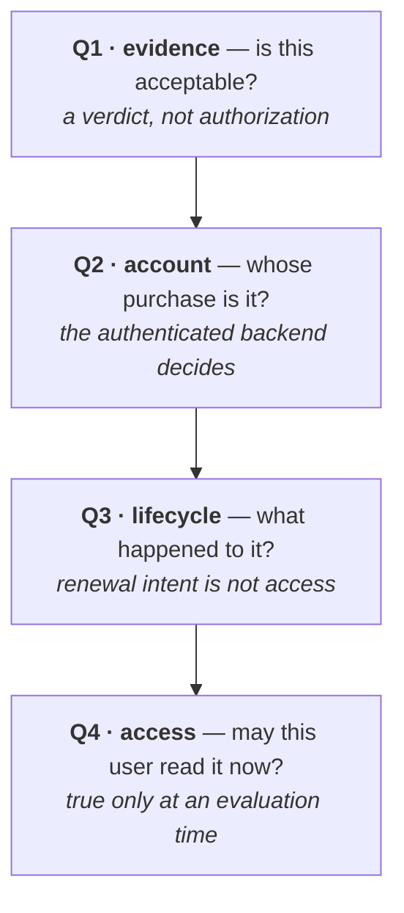
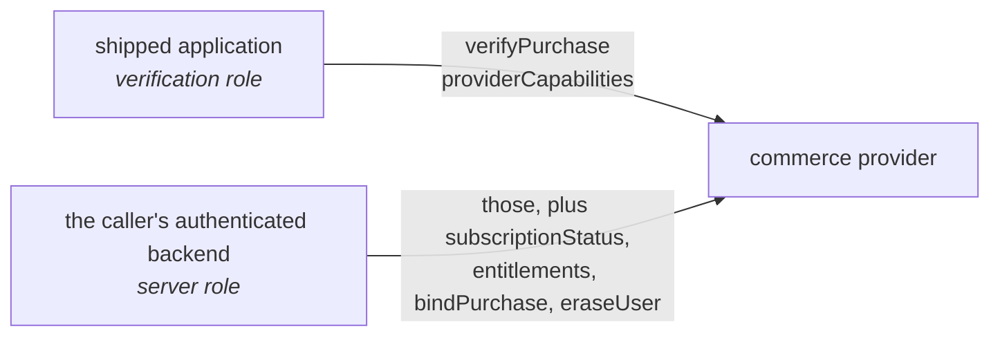
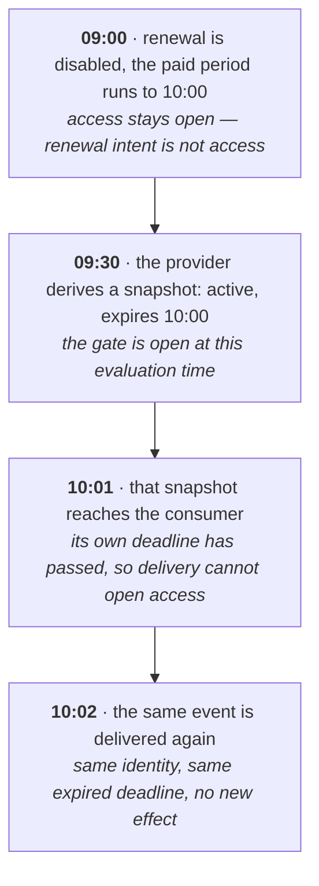

# Why the Commerce Protocol Draws Its Boundaries Where It Does

Version 1.0, 6 September 2026. A whitepaper for engineers who verify
purchases on a server: why the OpenIAP Commerce Protocol draws its decision
boundaries where it does, and what each one costs you to get wrong. It
reports no measured result and has not been peer reviewed. [SPEC.md](SPEC.md)
is authoritative for the normative wording; this explains the reasoning behind
it.

Published as a PDF at <https://www.openiap.dev/commerce-protocol-rationale.pdf>.
Released under the MIT License, like the rest of the project. Cite it as:
OpenIAP contributors, _Why the Commerce Protocol Draws Its Boundaries Where
It Does_, version 1.0, 6 September 2026.

## In short

A provider accepting purchase evidence does not authorize a particular user's
current access. Evidence acceptance, account ownership, subscription
lifecycle and current entitlement are four different questions, and an
integration has to keep them apart across store APIs, provider
implementations, transport bindings and events that arrive late.

OpenIAP Commerce Protocol is a vendor-neutral server-side contract that makes
those boundaries explicit and turns a defined subset of them into checks a
provider can be run against. GraphQL source defines the structure and
machine-readable metadata, and the build generates the REST and GraphQL
bindings, capability discovery and JSON Schemas from it. Normative prose
defines the behavior, and the conformance vectors encode those rules by hand
against the generated schemas. That hand step is where drift is most likely
to enter.

The sections below cover the six boundaries, the two roles, the temporal
meaning of an entitlement snapshot, event identity and recovery, and what the
contract still leaves to you. What the current checks do and do not establish
is recorded in the
[evaluation record](https://github.com/hyodotdev/openiap/blob/main/knowledge/research/commerce-protocol-evaluation.md);
the open questions and what would settle them are in the
[research agenda](https://github.com/hyodotdev/openiap/blob/main/knowledge/research/research-agenda.md).

## 1. Five symptoms

If you ship subscriptions, some of these have happened to you.

A paying customer is locked out because your verification provider was down
and the code treated "no answer" as "not a valid purchase." A customer turns
off auto-renewal on Tuesday and loses access on Tuesday, though they paid
through the end of the month. A webhook arrives late, after the subscription
it describes has already expired, and your handler opens the gate anyway
because the payload says `active`. The same webhook arrives twice and the
customer is credited twice. You move to a different verification provider and
your event handling breaks, because nothing said what its events were
supposed to mean.

None of these is a payment bug. Every one of them is a boundary that got
crossed: a question was answered with the answer to a different question.



**Figure 1.** Four questions an integration must keep apart. Answering one
does not answer the next.

The stores say as much themselves. Google's lifecycle guidance distinguishes
cancellation before the end of a paid period from expiration, and describes
continued access during grace [[3]](#ref-3). Apple defines a notification's
subscription status relative to the time the notification was signed
[[4]](#ref-4). What a message asserts and when that assertion applies are two
different things.

The design question behind the specification follows from that: **how can a
server contract preserve the meaning of purchase verification and current
entitlements across provider and transport boundaries?** Everything below
answers it for OpenIAP Commerce Protocol 1.0 [[5]](#ref-5), with IAPKit as
the reference implementation.

The scope is principally auto-renewing subscriptions on Apple and Google
Play, although the protocol's store identifier space is extensible. The
contract does not prescribe every store transition, implement payment
settlement, or amount to a complete commerce platform.

## 2. What this reasoning rests on

The boundaries below are not invented here. Two decades of results say that
integrations fail at the seams rather than in the cryptography: logic flaws
at the merchant-cashier boundary let shoppers pay nothing without breaking
anything [[12]](#ref-12); automatically rewriting apps so on-device checks
returned success defeated in-app billing [[11]](#ref-11), and a later attack
reached the same result by instrumenting the running app [[1]](#ref-1);
flawed third-party payment integrations were traced to SDK design,
documentation and sample code [[2]](#ref-2), and a decade after the
cashier-as-a-service results the same class of flaw was still being reported
[[13]](#ref-13). One result shaped this document's form
more than the others: Chen et al. found payment-integration requirements that
developers cannot enforce because the guidance itself loses sight of the
parameters a check would need [[22]](#ref-22). An obligation written only as
advice is not an obligation. It has to be something an implementation can
fail.

The event rules come from the same place. Repeated messages need
application-level handling and often remembered state, and an operation that
is naturally idempotent is a different thing from one made idempotent
[[6]](#ref-6), [[14]](#ref-14). Idempotence alone still does not resolve
missing events, stale snapshots or ambiguous ordering, which is why the
contract addresses those separately.

Three of the design choices here have a source. Test vectors are derived from
the contract rather than from an implementation [[8]](#ref-8), because a
structural description alone says nothing about whether an answer means what
the prose requires [[15]](#ref-15). Expected outcomes are reviewed separately
from the implementations, since two of them agreeing is not evidence when
both are wrong [[9]](#ref-9). And an unavailable verifier and an incomplete
read get explicit rules rather than being left to each implementer, because
catastrophic failures concentrate in already-signalled errors that were
mishandled — 92% against 25% for non-catastrophic ones, in five distributed
data systems [[10]](#ref-10). That last inference is ours; those are
different systems.

Two comparisons place the work. Bishop et al. wrote a behavioral
specification of TCP and Sockets and checked real implementations against it
[[21]](#ref-21) — the same shape as this, except theirs was validated against
implementations they had not written, while this one is authored alongside
one of its own. Pact is the contract testing you will compare this to
[[23]](#ref-23); its contracts are consumer-driven, recorded from what one
consumer needs, whereas these obligations do not change when a new consumer
appears. Event interchange has a vendor-neutral envelope of its own
[[7]](#ref-7), which this contract is not a profile of.

## 3. Problem model and trust boundaries

### 3.1 Actors and observations

The model contains four actors: a store, a commerce provider, a developer
backend, and an application. The store is the source of purchase evidence
and lifecycle facts. The provider verifies evidence and exposes normalized
operations and events. The developer backend owns application-account
authorization and consumes the provider's account-scoped results. The
application initiates purchases and may request account-free verification.

The contract distinguishes a transaction, a subscription, an event, and an
entitlement. A transaction records an economic occurrence; a subscription
describes an arrangement; an event records a change or observation; an
entitlement expresses access at an evaluation time. A verification verdict
is a separate observation about submitted evidence. These are conceptual
boundaries, not interchangeable names for one boolean.

For discussion, let a verification outcome be one of:

```text
V(evidence) = Accepted | Rejected | OperationError(code)
```

This notation summarizes the existing contract; it does not add a wire type.
`Accepted` and `Rejected` correspond to successful operation results with
`isValid: true` and `isValid: false`. If the provider cannot obtain a verdict,
the relevant operation error is `VERIFICATION_FAILED`. Other conditions,
such as authentication failure or rate limiting, retain their own categories.
No outcome in this expression independently proves which application
account owns the purchase.

### 3.2 Fault and adversary assumptions

The application may be modified, and a credential shipped inside it may be
copied. Requests can contain malformed or mismatched evidence. An upstream
verification call can fail without producing a verdict. Store notifications
and provider webhooks can be delayed, repeated, or unavailable. A downstream
consumer may observe a previously correct snapshot after its deadline.

The design assumes that the provider and developer backend enforce their
declared roles and that actual verification establishes the required trust
in store evidence. Conformance tests can expose specific violations of these
obligations; they cannot establish that a malicious provider tells the truth
or that a compromised backend protects its users. Cryptographic primitive
security, stolen server credentials, and exhaustive store-verifier analysis
are outside what any of the current checks address.

### 3.3 Decision-preservation obligations

Table 1 summarizes the selected obligations from the specification
[[5]](#ref-5). The specification remains authoritative for their complete
wording and exceptions.

| Boundary                    | Required distinction                                       | Consequence for an integration                                           |
| --------------------------- | ---------------------------------------------------------- | ------------------------------------------------------------------------ |
| Evidence to verdict         | Rejection differs from inability to obtain a verdict.      | An unavailable verifier cannot supply a negative purchase verdict.       |
| Verdict to account          | Verification does not establish a binding.                 | Account association requires the authenticated backend's decision.       |
| Lifecycle to access         | Renewal intent differs from current entitlement.           | Disabling renewal does not itself close an unexpired paid gate.          |
| Snapshot to delivery        | Evaluation time differs from arrival time.                 | A delayed grant cannot open access at or after its known expiry.         |
| Repeated delivery to effect | An event identity is stable within its emitter context.    | Reprocessing that event must not repeat substantive effects.             |
| Provider to consumer        | Compatible semantics need not imply identical identifiers. | Portability comparisons normalize only differences the contract permits. |

These distinctions prevent particular category errors. Whether developers
apply them correctly, and how often existing systems violate them, require
empirical study beyond the contract's definition.

## 4. Protocol design

### 4.1 Authored contract and generated artifacts

The protocol separates structural authoring from behavioral obligations.
GraphQL source files [[16]](#ref-16) define types, operations, and contract
metadata; normative prose, using the RFC 2119 keywords [[19]](#ref-19),
defines their meaning. The build generates the assembled contract, JSON
Schemas in draft 2020-12 [[17]](#ref-17), operation artifacts, REST and
GraphQL bindings, OpenAPI 3.1 documentation [[18]](#ref-18), and lifecycle
vectors. Checks reject drift between
authored inputs and checked-in outputs.

These artifacts are distributable without an OpenIAP account or a central
runtime service. The portable runner imports no IAPKit implementation and
uses caller-supplied adapters and validation support. A provider can expose
supported profiles and bindings through capability discovery. Thus adopting
the contract does not require adopting IAPKit's storage, deployment model,
or credential format.

Single-source generation reduces opportunities for artifacts to disagree,
but also creates a shared-fault risk. A mistaken authored rule can propagate
consistently into every generated artifact. Drift checks and behavioral
validation therefore answer different questions.

### 4.2 Operations and authorization

The six operations are `verifyPurchase`, `subscriptionStatus`,
`entitlements`, `bindPurchase`, `eraseUser`, and `providerCapabilities`.
Providers declare their supported profiles and must answer honestly for what
they declare. A caller can branch on those declarations. A caller that skips
discovery is not punished for it: an operation from a profile the provider
serves is not refused on that ground, though it can still fail for any
ordinary reason, and an operation from an unserved profile returns
`UNSUPPORTED_PROFILE` rather than a wrong answer.

`verifyPurchase` is account-free. It accepts store-discriminated evidence
and returns the authoritative `isValid` gate; its advisory `state` field
does not replace that gate. The operation cannot read, select, or mutate
account state. `bindPurchase`, by contrast, requires the server role,
associates evidence with the backend's user identity, and does not transfer
an existing binding. Possession of evidence alone is deliberately
insufficient authority to bind it.



**Figure 2.** What each role may call. A verification credential must never
reach an account read or mutation, which is what stops a shipped application
from walking arbitrary user identities.

The server-only status and entitlement operations return tokenless views.
They exclude purchase tokens, signed receipts, store transaction identities,
and provider-internal record identifiers. Unknown optional information is
omitted, though GraphQL cannot express omitted-versus-null on a selected
member, so there it arrives as `null` and a caller normalizes that to absent.
If an operation cannot provide the complete answer required by the
contract, it fails rather than presenting a partial read as complete.

Authorization for privileged operations precedes operation-input validation,
including GraphQL variable coercion. A resolver-only check is insufficient
because coercion can execute first. The specification allows earlier
transport-shape failures, such as an unparseable document. This ordering
makes the role boundary observable and testable without making it dependent
on the implementation's internal call structure.

### 4.3 Temporal entitlement semantics

For an event carrying a subscription snapshot, let `s` be its state, `d`
its optional expiry, and `t` its `processedAt`. The provider evaluates the
following predicate, restated from specification §2.3:

```text
A(s, d, t) =
  (s is Active or InGracePeriod)
  and (d is absent or t < d)
```

For grace, `d` is the grace deadline. At equality the gate is closed. When
expiry is absent, the predicate follows the state but supplies no deadline
or general freshness guarantee. The provider places this result in
`subscription.active`. Consumers read that decision instead of reconstructing
it from `state` while ignoring `active`.

A consumer applying a true snapshot must additionally respect a present
deadline at arrival and during subsequent use. It can schedule expiry or
obtain an authoritative status before the deadline. These duties do not
allow a false snapshot to become true merely because its state label looks
active. When no deadline is available, freshness requirements need an
appropriate authoritative status source.

Consider the illustrative trace in Figure 3. Times are synthetic and do not
report a store experiment. Assume a bound subscription, no intervening
revocation, and a known paid deadline at 10:00.



**Figure 3.** A snapshot that was true when it was evaluated does not become
authorization when it arrives. A correct signature and an originally correct
`active` value are insufficient to authorize access at a later time.

### 4.4 Events, identity, and recovery

The event path is store to provider to developer backend. The protocol
defines bounded request/response operations for application-facing
verification and server reads; its GraphQL binding has no Subscription
root. Device notification delivery remains a developer-backend concern.

Provider delivery is duplicate-capable and unordered. An event can be
accepted zero times if delivery permanently fails or its retry budget is
exhausted. The emitter preserves event identity and body across retries,
while transport signing, an HMAC-SHA256 [[20]](#ref-20) over the attempt's
timestamp and the exact body bytes, uses the current attempt's timestamp. Consumers
deduplicate within the emitter's identity context and handle substantive
effects idempotently. Retries do not supply an exactly-once guarantee.

When a consumer can correlate a stable purchase, an older snapshot cannot
overwrite newer state. This does not make every effect of an older event
obsolete. Nor does it create a universal ordering key: a user identity or
product identity alone may be insufficient, and equal occurrence timestamps
provide no tiebreaker. A consumer unable to establish current state uses
the declared status or entitlement operations, or an emitter-specific
authoritative source if those operations are unavailable.

First binding introduces another temporal boundary. Previously unbound
changes are coalesced into the current gate; an expired historical grant is
not replayed as a new entitlement. Actionable entitlement events require
both a user and product identity. These rules connect purchase observation
to account access without making account association implicit in verification.

### 4.5 Portability and evolution

The contract defines compatibility at the level of supported profiles,
bindings, and observable results. Protocol versions and package-distribution
versions are distinct. Some value spaces and objects allow compatible
additions, while closed tokenless results and error envelopes restrict
what a provider can return.

REST and GraphQL need not produce byte-identical documents. Their envelope
rules and treatment of unknown input members differ, so cross-binding
comparison must use the defined semantics. It must still detect a binding
that silently drops required information or changes an operation failure
into a successful answer.

It is worth separating what this project claims from what it does not. The
individual distinctions are established practice: Google's own lifecycle
guidance already separates a cancellation from the end of access
[[3]](#ref-3), and this document does not claim to have introduced that one
or any of the others.

Provider switching has a narrower meaning than automatic migration.
Consumers may preserve their domain logic under compatible contracts while
changing credentials and endpoints. Historical data, purchase correlation,
and overlapping deliveries remain operational responsibilities. Emitter
identifiers are not globally interchangeable, and this version does not
guarantee deduplication across a provider cutover.

## 5. What this does not give you

The same person wrote the specification, the generators, the tests, the
reference implementation and this document. Consistency among them proves
they agree with each other, not that they are right. Independent review of
the store mappings and the expected outcomes is what would reduce that risk,
and it has not happened.

The checks are finite and selected. There is no proof over every possible
event sequence, no evidence from real store verification, and no
demonstration that two independently operated providers interoperate. The
[evaluation record](https://github.com/hyodotdev/openiap/blob/main/knowledge/research/commerce-protocol-evaluation.md)
states exactly what the current tests do and do not establish; the
[research agenda](https://github.com/hyodotdev/openiap/blob/main/knowledge/research/research-agenda.md)
states what would settle the open questions.

Some work stays with you, and one gap is worth naming precisely. The gate is
per user and product, so an entitlement event carries both. What the contract
does not define is how rights compose when more than one thing can supply the
same access. A product change moves one subscription from one product to
another, and the lifecycle vectors model that as a single gate transitioning
rather than the outgoing product's rights closing and the incoming product's
opening. Even when a refund identifies a transaction, nothing says
which grant loses authority while a later period or a second purchase is
still valid. Family
sharing separates the purchaser from the beneficiary, and a promotional grant
has no purchase behind it at all; neither appears in the contract. Account
merging is declared out of scope. A single subscription per user avoids only the
part that comes from holding several at once; a product change or a refunded
earlier renewal still raises the question. Wherever more than one grant, or
one grant's history, can bear on the same access, the composition rules are
yours to write, and they are the part most likely to go wrong.

The contract also does not define a complete store transition machine,
universal purchase correlation, or historical-data migration. Where an expiry
or an event is missing you need an authoritative read; no envelope makes an
old observation current.

## 6. When this is worth adopting

Start by reading Table 1 against the code you already have. That costs an
hour and needs no adoption at all. Find where
your verification call fails and confirm the failure does not become a
rejection. Find your cancellation handler and confirm it does not close
access before the paid period ends. Write one test that delivers a valid
entitlement snapshot after its own expiry and assert your gate stays closed.
Passing all three does not mean the integration is right; it means these
three failures are not present. Account authority, duplicate effects and
portability are untested by them, and Table 1 is where to look next.

If one fails, the smallest useful step is still not adoption. For the
verification case it is §3.1's separation of a rejected verdict from an
operation error, so an unreachable verifier stops producing a negative
purchase verdict. For the other two it is the entitlement predicate in §4.3:
evaluate access from state and expiry at a stated evaluation time, and stop
reading a lifecycle label as an access decision. Both are changes inside your
own code.

Adopt the contract itself when you verify on a server for more than one
store, and want one decision to hold across stores whose evidence,
notifications and lifecycle vocabularies do not match, with the rules written
somewhere that does not belong to your provider. If you also ship several
client frameworks, the separate client contract in this repository addresses
that side; the two are complementary and neither requires the other.

The alternatives are worth naming honestly. A store's own server API is
authoritative but store-specific by construction, so using them directly
leaves the cross-store decision to you. A hosted entitlement service makes
that decision for you and documents it well. The mature ones publish their
cancellation, expiration and grace semantics, their duplicate handling, and
their versioning and deprecation commitments, and you can hold them to all of
it.
What that documentation describes is how to use one service, so its semantics
belong to that service and the expectations you build from them are not
reusable against another. This contract is the third option: the same
decisions written as a specification any provider can implement, with one set
of checks that runs against all of them. It is younger and less proven than either
alternative, and it does not run anything for you. The
closest thing to it in shape is TM Forum's Product Inventory Management API
[[24]](#ref-24), a standard carrying a conformance profile and a test kit,
though what it standardizes is product inventory and its lifecycle
notifications for telecommunications rather than store purchase evidence and
the entitlement decisions that follow from it.

Do not adopt it expecting a hosted service; that is IAPKit's job, and IAPKit
is one implementation of this contract rather than the contract itself. Do
not adopt it expecting the checks to prove your provider correct. They test a
defined subset of obligations, which is a floor and not a guarantee.

The contract, the generated artifacts and the portable checks are published
under the same terms as the rest of the project, so a second implementation
can be built and held to them without asking anyone.

## References

Scholarly metadata and reading status are maintained in
[bibliography.md](https://github.com/hyodotdev/openiap/blob/main/knowledge/research/bibliography.md);
the entries below reproduce what this document cites so that it can be read on
its own.

<!-- Scholarly entries are derived from bibliography.md; update metadata there first. -->

<a id="ref-1"></a>

[1] Collin Mulliner, William Robertson, and Engin Kirda. 2014.
_VirtualSwindle: An Automated Attack Against In-App Billing on Android._
ACM AsiaCCS. DOI: 10.1145/2590296.2590335.
[Publisher DOI](https://doi.org/10.1145/2590296.2590335).

<a id="ref-2"></a>

[2] Wenbo Yang, Yuanyuan Zhang, Juanru Li, Hui Liu, Qing Wang, Yueheng Zhang,
and Dawu Gu. 2017. _Show Me the Money! Finding Flawed Implementations of
Third-party In-app Payment in Android Apps._ NDSS.
[Paper](https://www.ndss-symposium.org/wp-content/uploads/2017/09/ndss2017_05A-2_Yang_paper.pdf).

<a id="ref-3"></a>

[3] Google. _Subscription lifecycle._ Google Play Billing documentation.
Vendor documentation; accessed 5 September 2026.
[Lifecycle guidance](https://developer.android.com/google/play/billing/lifecycle/subscriptions).

<a id="ref-4"></a>

[4] Apple. _status._ App Store Server Notifications documentation.
Vendor documentation; accessed 5 September 2026 through its Markdown representation.
[Status definition](https://developer.apple.com/documentation/appstoreservernotifications/status).

<a id="ref-5"></a>

[5] OpenIAP contributors. _OpenIAP Commerce Protocol Specification 1.0._
Evaluated project artifact at commit
`100557091077dddcd8e1f22128f80bd2b9747912`, accessed 5 September 2026.
[Pinned specification](https://github.com/hyodotdev/openiap/blob/100557091077dddcd8e1f22128f80bd2b9747912/specs/commerce-protocol/SPEC.md).
This is the subject of the study, not independent evidence of its effectiveness.

<a id="ref-6"></a>

[6] Pat Helland. 2007. _Life beyond Distributed Transactions: an Apostate's
Opinion._ CIDR. Position paper.
[Paper](https://www.cidrdb.org/cidr2007/papers/cidr07p15.pdf).

<a id="ref-7"></a>

[7] CloudEvents authors. _CloudEvents, Version 1.0.2._ Technical specification;
accessed 5 September 2026.
[Pinned specification](https://github.com/cloudevents/spec/blob/v1.0.2/cloudevents/spec.md).

<a id="ref-8"></a>

[8] Mark Utting, Alexander Pretschner, and Bruno Legeard. 2012.
_A Taxonomy of Model-Based Testing Approaches._ Software Testing,
Verification and Reliability 22(5), 297-312. DOI: 10.1002/stvr.456.
[University record](https://researchcommons.waikato.ac.nz/entities/publication/eb140299-43b5-4d35-8aae-5fcd8d519b90).

<a id="ref-9"></a>

[9] Jie Ma, Ningyu He, Jinwen Xi, Mingzhe Xing, Liangxin Liu, Jiushenzi Luo,
Xiaopeng Fu, Chiachih Wu, Haoyu Wang, Ying Gao, and Yinliang Yue. 2026.
_When Specifications Meet Reality: Uncovering API Inconsistencies in
Ethereum Infrastructure._ Proceedings of the ACM on Programming Languages
10, OOPSLA1, Article 111. DOI: 10.1145/3798219.
[Open version](https://arxiv.org/abs/2603.06029).

<a id="ref-10"></a>

[10] Ding Yuan, Yu Luo, Xin Zhuang, Guilherme Renna Rodrigues, Xu Zhao, Yongle
Zhang, Pranay U. Jain, and Michael Stumm. 2014. _Simple Testing Can Prevent
Most Critical Failures: An Analysis of Production Failures in Distributed
Data-Intensive Systems._ OSDI, 249-265.
[Publisher record and paper](https://www.usenix.org/conference/osdi14/technical-sessions/presentation/yuan).

<a id="ref-11"></a>

[11] Daniel Reynaud, Eui Chul Richard Shin, Thomas R. Magrino, Edward X. Wu,
and Dawn Song. 2012. _FreeMarket: Shopping for free in Android applications._
NDSS.
[Programme entry](https://www.ndss-symposium.org/ndss2012/ndss-2012-programme/freemarket-shopping-free-android-applications/).

<a id="ref-12"></a>

[12] Rui Wang, Shuo Chen, XiaoFeng Wang, and Shaz Qadeer. 2011. _How to Shop
for Free Online: Security Analysis of Cashier-as-a-Service Based Web Stores._
IEEE Symposium on Security and Privacy, 465-480. DOI: 10.1109/SP.2011.26.
[Publisher DOI](https://doi.org/10.1109/SP.2011.26).

<a id="ref-13"></a>

[13] Shangcheng Shi, Xianbo Wang, and Wing Cheong Lau. 2021. _Breaking and
Fixing Third-Party Payment Service for Mobile Apps._ ACNS, LNCS 12727, 3-26.
DOI: 10.1007/978-3-030-78375-4_1.
[Publisher DOI](https://doi.org/10.1007/978-3-030-78375-4_1).

<a id="ref-14"></a>

[14] Pat Helland. 2012. _Idempotence Is Not a Medical Condition._ ACM Queue
10(4), 30-46. DOI: 10.1145/2181796.2187821.
[Publisher DOI](https://doi.org/10.1145/2181796.2187821).

<a id="ref-15"></a>

[15] Vaggelis Atlidakis, Patrice Godefroid, and Marina Polishchuk. 2019.
_RESTler: Stateful REST API Fuzzing._ ICSE, 748-758.
DOI: 10.1109/ICSE.2019.00083.
[Publisher DOI](https://doi.org/10.1109/ICSE.2019.00083).

References 16 to 20 are the technical specifications the contract is built
on: its artifact formats, its requirement keywords, and the message
authentication its webhook signatures use. Reference 23 identifies a testing
tool the text compares against, and 24 a standard it is measured against.
None of them is evidence about OpenIAP.

<a id="ref-16"></a>

[16] GraphQL Foundation. _GraphQL Specification, October 2021 Edition._
Technical specification; accessed 6 September 2026. The repository does not
pin an edition.
[Specification](https://spec.graphql.org/October2021/).

<a id="ref-17"></a>

[17] JSON Schema. _JSON Schema Specification, draft 2020-12._ Technical
specification; accessed 6 September 2026. The generated schemas declare this
dialect.
[Specification](https://json-schema.org/draft/2020-12).

<a id="ref-18"></a>

[18] OpenAPI Initiative. _OpenAPI Specification 3.1.0._ Technical
specification; accessed 6 September 2026.
[Specification](https://spec.openapis.org/oas/v3.1.0.html).

<a id="ref-19"></a>

[19] Scott Bradner. 1997. _Key words for use in RFCs to Indicate Requirement
Levels._ RFC 2119. DOI: 10.17487/RFC2119.
[RFC](https://www.rfc-editor.org/rfc/rfc2119).

<a id="ref-20"></a>

[20] Hugo Krawczyk, Mihir Bellare, and Ran Canetti. 1997. _HMAC: Keyed-Hashing
for Message Authentication._ RFC 2104. DOI: 10.17487/RFC2104.
[RFC](https://www.rfc-editor.org/rfc/rfc2104).

<a id="ref-21"></a>

[21] Steve Bishop, Matthew Fairbairn, Michael Norrish, Peter Sewell, Michael
Smith, and Keith Wansbrough. 2005. _Rigorous specification and conformance
testing techniques for network protocols, as applied to TCP, UDP, and
Sockets._ SIGCOMM, 265-276. DOI: 10.1145/1080091.1080123.
[Publisher DOI](https://doi.org/10.1145/1080091.1080123).

<a id="ref-22"></a>

[22] Yi Chen, Luyi Xing, Yue Qin, Xiaojing Liao, XiaoFeng Wang, Kai Chen, and
Wei Zou. 2019. _Devils in the Guidance: Predicting Logic Vulnerabilities in
Payment Syndication Services through Automated Documentation Analysis._
USENIX Security, 747-764.
[Publisher record and paper](https://www.usenix.org/conference/usenixsecurity19/presentation/chen-yi).

<a id="ref-23"></a>

[23] Pact Foundation. _How Pact works._ Tool documentation; accessed
6 September 2026.
[Documentation](https://docs.pact.io/getting_started/how_pact_works).

<a id="ref-24"></a>

[24] TM Forum. _Product Inventory Management API (TMF637), v5.0._ Open API
specification; accessed 6 September 2026.
[Specification](https://www.tmforum.org/open-digital-architecture/open-apis/product-inventory-management-api-TMF637/v5.0).
