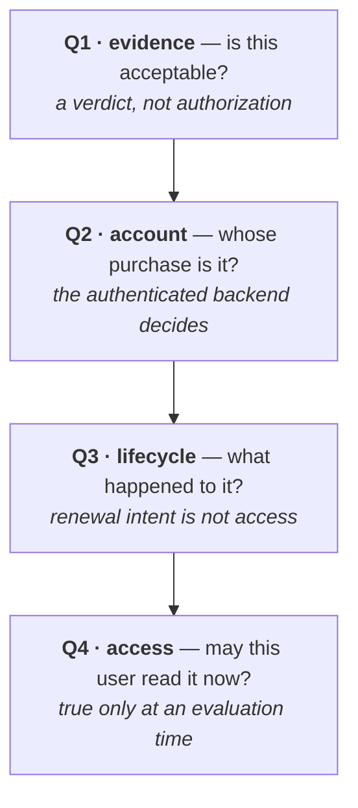
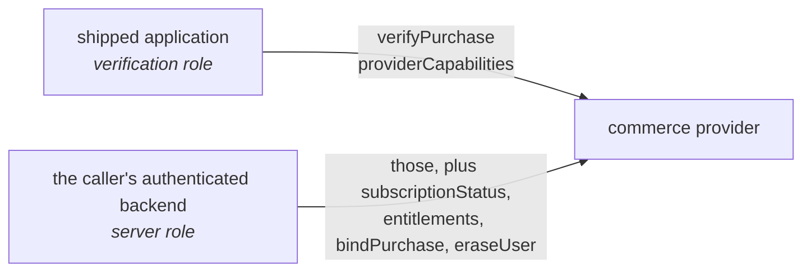
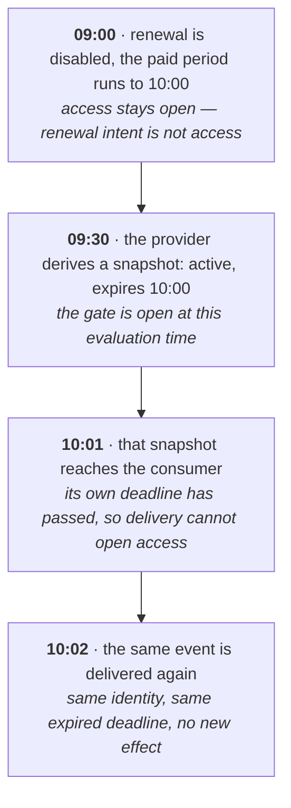
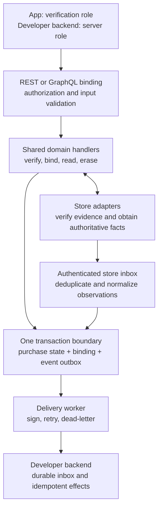
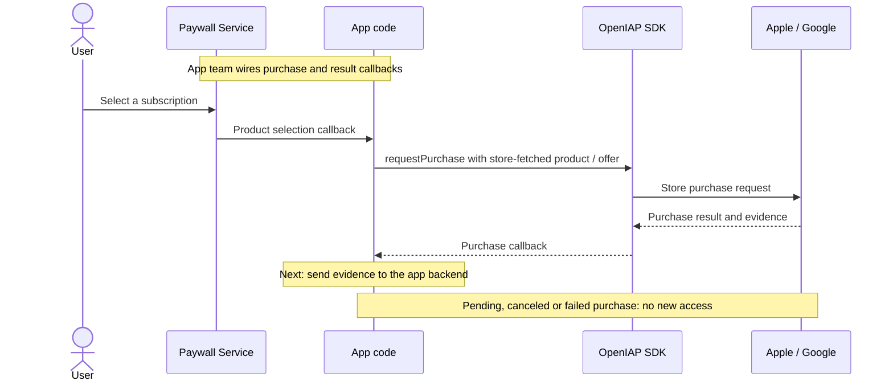
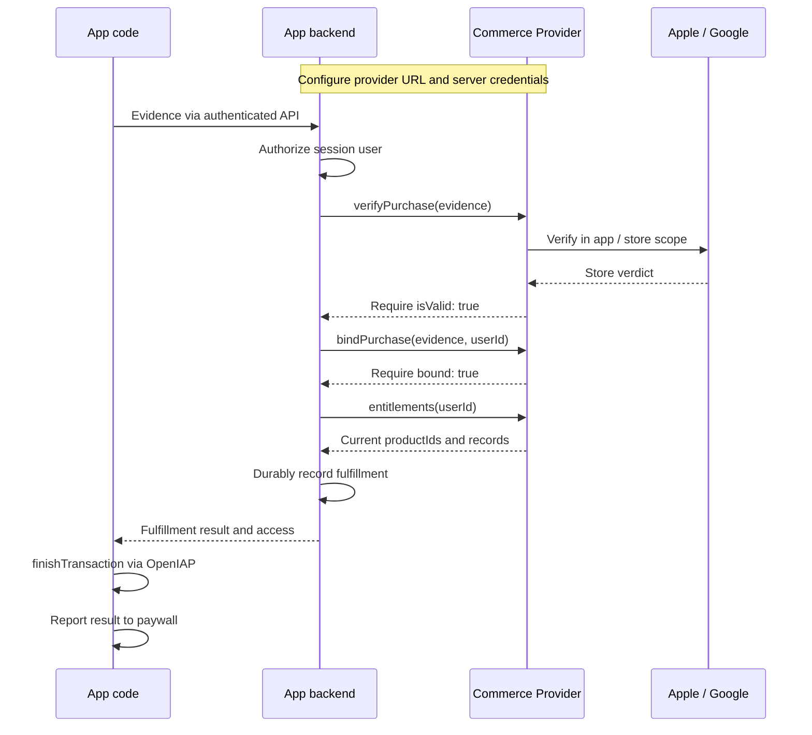
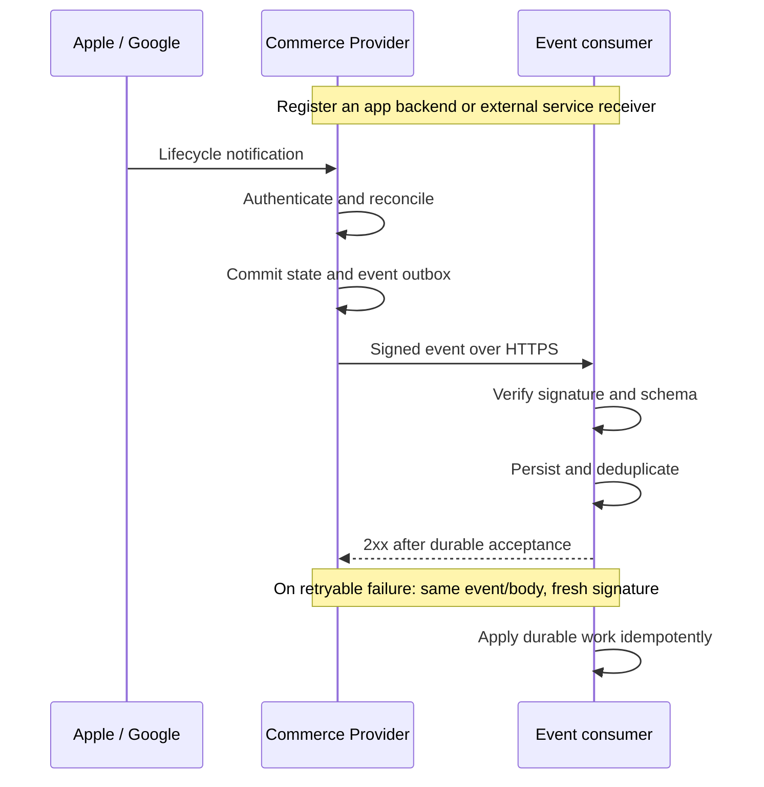
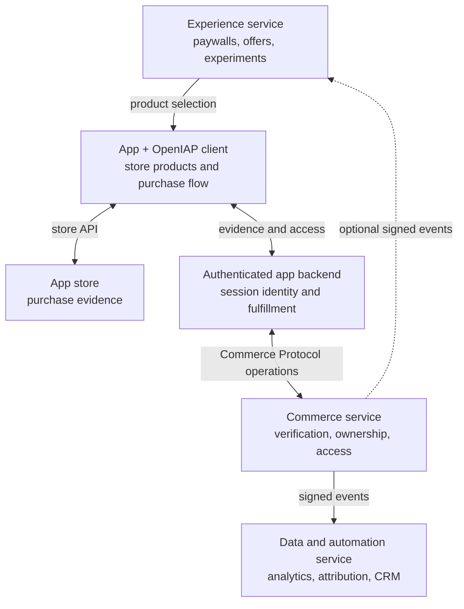

# Why the Commerce Protocol Draws Its Boundaries Where It Does

Version 1.1, 7 September 2026. A whitepaper for engineers who verify
purchases on a server: why the OpenIAP Commerce Protocol draws its decision
boundaries where it does, how to implement those boundaries in a backend, and how specialist products
connect around them. It
reports no measured result and has not been peer reviewed. [SPEC.md](SPEC.md)
is authoritative for the normative wording; this explains the reasoning behind
it.

Published as a PDF at <https://www.openiap.dev/commerce-protocol-rationale.pdf>.
Released under the MIT License, like the rest of the project. Cite it as:
OpenIAP contributors, _Why the Commerce Protocol Draws Its Boundaries Where
It Does_, version 1.1, 7 September 2026.

## Abstract

A provider accepting purchase evidence does not authorize a particular user's
current access. Evidence acceptance, account ownership, subscription
lifecycle and current entitlement are four different questions, and an
integration has to keep them apart across store APIs, provider
implementations, transport bindings and events that arrive late.

OpenIAP Commerce Protocol is a vendor-neutral server-side contract that makes
those boundaries explicit and turns a defined subset of them into checks a
provider can be run against. GraphQL source defines the structure and
machine-readable metadata, and the build generates the REST and GraphQL
bindings, capability discovery and JSON Schemas from it. Normative prose
defines the behavior, and the conformance vectors encode those rules by hand
against the generated schemas. That hand step is where drift is most likely
to enter.

The sections below cover the six boundaries, the two authorization roles, the temporal
meaning of an entitlement snapshot, event identity and recovery, and what the
contract still leaves to you. What the current checks do and do not establish
is recorded in the
[evaluation record](https://github.com/hyodotdev/openiap/blob/main/knowledge/research/commerce-protocol-evaluation.md);
the open questions and what would settle them are in the
[research agenda](https://github.com/hyodotdev/openiap/blob/main/knowledge/research/research-agenda.md).

## 1. Five symptoms

If you ship subscriptions, some of these have happened to you.

A paying customer is locked out because your verification provider was down
and the code treated "no answer" as "not a valid purchase." A customer turns
off auto-renewal on Tuesday and loses access on Tuesday, though they paid
through the end of the month. A webhook arrives late, after the subscription
it describes has already expired, and your handler opens the gate anyway
because the payload says `active`. The same webhook arrives twice and the
customer is credited twice. You move to a different verification provider and
your event handling breaks, because nothing said what its events were
supposed to mean.

None of these is a payment bug. Every one of them is a boundary that got
crossed: a question was answered with the answer to a different question.



**Figure 1.** Four questions an integration must keep apart. Answering one
does not answer the next.

The stores say as much themselves. Google's lifecycle guidance distinguishes
cancellation before the end of a paid period from expiration, and describes
continued access during grace [[3]](#ref-3). Apple defines a notification's
subscription status relative to the time the notification was signed
[[4]](#ref-4). What a message asserts and when that assertion applies are two
different things.

The design question behind the specification follows from that: **how can a
server contract preserve the meaning of purchase verification and current
entitlements across provider and transport boundaries?** Everything below
answers it for OpenIAP Commerce Protocol 1.0 [[5]](#ref-5), with IAPKit as
the reference implementation.

The scope is principally auto-renewing subscriptions on Apple and Google
Play, although the protocol's store identifier space is extensible. The
contract does not prescribe every store transition, implement payment
settlement, or amount to a complete commerce platform.

## 2. What this reasoning rests on

The boundaries below are not invented here. A decade of results shows
integrations failing at the seams with the cryptography intact: logic flaws
at the merchant-cashier boundary let shoppers pay nothing without breaking
anything [[12]](#ref-12); automatically rewriting apps so on-device checks
returned success defeated in-app billing [[11]](#ref-11), and a later attack
reached the same result by instrumenting the running app [[1]](#ref-1);
flawed third-party payment integrations were traced to SDK design,
documentation and sample code [[2]](#ref-2), and a decade after the
cashier-as-a-service results the same class of flaw was still being reported
[[13]](#ref-13). One result shaped this document's form more than the
others: Chen et al. found payment-integration requirements a developer
cannot enforce, because the parameters a check would need are not available
to the party asked to perform it, and because guidance omits checks that are
required [[22]](#ref-22). The conclusion we draw from that is ours, not
theirs: an obligation written only as advice is one an implementation cannot
be failed against, so this contract states what can be checked.

The event rules come from the same place. Repeated messages need
application-level handling and often remembered state, and an operation that
is naturally idempotent is a different thing from one made idempotent
[[6]](#ref-6), [[14]](#ref-14). Idempotence alone still does not resolve
missing events, stale snapshots or ambiguous ordering, which is why the
contract addresses those separately.

Three of the design choices here have a source, though the choices remain
ours. Deriving tests from a model rather than from an implementation is an
established method [[8]](#ref-8), and generating stateful requests from a
service's own specification finds real defects [[15]](#ref-15) — in that work,
through server errors. The vectors here carry expected outcomes drawn from the
normative prose, so they check required behavior rather than only request
validity or a server error. Those outcomes are reviewed apart from the
implementations because independent implementations can share an error, which
is a finding [[9]](#ref-9); reviewing them separately is our response to it,
not a remedy that paper establishes.

And an unavailable verifier and an incomplete
read get explicit rules rather than being left to each implementer, because
catastrophic failures concentrate in already-signalled errors that were
mishandled — 92% against 25% for non-catastrophic ones, in five distributed
data systems [[10]](#ref-10). That last inference is ours; those are
different systems.

Two comparisons place the work. Bishop et al. wrote a behavioral
specification of TCP and Sockets and checked real implementations against it
[[21]](#ref-21) — the same shape as this, except theirs was validated against
implementations they had not written, while this one is authored alongside
one of its own. Pact is the contract testing you will compare this to
[[23]](#ref-23); its contracts are consumer-driven, recorded from what one
consumer needs, whereas these obligations do not change when a new consumer
appears. Event interchange has a vendor-neutral envelope of its own
[[7]](#ref-7), which this contract is not a profile of.

## 3. Problem model and trust boundaries

### 3.1 Actors and observations

The model contains four actors: a store, a commerce provider, a developer
backend, and an application. The store is the source of purchase evidence
and lifecycle facts. The provider verifies evidence and exposes normalized
operations and events. The developer backend owns application-account
authorization and consumes the provider's account-scoped results. The
application initiates purchases and may request account-free verification.

The contract distinguishes a transaction, a subscription, an event, and an
entitlement. A transaction records an economic occurrence; a subscription
describes an arrangement; an event records a change or observation; an
entitlement expresses access at an evaluation time. A verification verdict
is a separate observation about submitted evidence. These are conceptual
boundaries, not interchangeable names for one boolean.

For discussion, let a verification outcome be one of:

```text
V(evidence) = Accepted | Rejected | OperationError(code)
```

This notation summarizes the existing contract; it does not add a wire type.
`Accepted` and `Rejected` correspond to successful operation results with
`isValid: true` and `isValid: false`. If the provider cannot obtain a verdict,
the relevant operation error is `VERIFICATION_FAILED`. Other conditions,
such as authentication failure or rate limiting, retain their own categories.
No outcome in this expression independently proves which application
account owns the purchase.

### 3.2 Fault and adversary assumptions

The application may be modified, and a credential shipped inside it may be
copied. Requests can contain malformed or mismatched evidence. An upstream
verification call can fail without producing a verdict. Store notifications
and provider webhooks can be delayed, repeated, or unavailable. A downstream
consumer may observe a previously correct snapshot after its deadline.

The design assumes that the provider and developer backend enforce their
declared roles and that actual verification establishes the required trust
in store evidence. Conformance tests can expose specific violations of these
obligations; they cannot establish that a malicious provider tells the truth
or that a compromised backend protects its users. Cryptographic primitive
security, stolen server credentials, and exhaustive store-verifier analysis
are outside what any of the current checks address.

### 3.3 Decision-preservation obligations

Table 1 summarizes the selected obligations from the specification
[[5]](#ref-5). The specification remains authoritative for their complete
wording and exceptions.

| Boundary                    | Required distinction                                       | Consequence for an integration                                           |
| --------------------------- | ---------------------------------------------------------- | ------------------------------------------------------------------------ |
| Evidence to verdict         | Rejection differs from inability to obtain a verdict.      | An unavailable verifier cannot supply a negative purchase verdict.       |
| Verdict to account          | Verification does not establish a binding.                 | Account association requires the authenticated backend's decision.       |
| Lifecycle to access         | Renewal intent differs from current entitlement.           | Disabling renewal does not itself close an unexpired paid gate.          |
| Snapshot to delivery        | Evaluation time differs from arrival time.                 | A delayed grant cannot open access at or after its known expiry.         |
| Repeated delivery to effect | An event identity is stable within its emitter context.    | Reprocessing that event must not repeat substantive effects.             |
| Provider to consumer        | Compatible semantics need not imply identical identifiers. | Portability comparisons normalize only differences the contract permits. |

These distinctions prevent particular category errors. Whether developers
apply them correctly, and how often existing systems violate them, require
empirical study beyond the contract's definition.

## 4. Protocol design

### 4.1 Authored contract and generated artifacts

The protocol separates structural authoring from behavioral obligations.
GraphQL source files [[16]](#ref-16) define types, operations, and contract
metadata; normative prose, using the RFC 2119 keywords [[19]](#ref-19),
defines their meaning. The build generates the assembled contract, JSON
Schemas in draft 2020-12 [[17]](#ref-17), operation artifacts, REST and
GraphQL bindings, OpenAPI 3.1 documentation [[18]](#ref-18), and lifecycle
vectors. Checks reject drift between
authored inputs and checked-in outputs.

These artifacts are distributable without an OpenIAP account or a central
runtime service. The portable runner imports no IAPKit implementation and
uses caller-supplied adapters and validation support. A provider can expose
supported profiles and bindings through capability discovery. Thus adopting
the contract does not require adopting IAPKit's storage, deployment model,
or credential format.

Single-source generation reduces opportunities for artifacts to disagree,
but also creates a shared-fault risk. A mistaken authored rule can propagate
consistently into every generated artifact. Drift checks and behavioral
validation therefore answer different questions.

### 4.2 Operations and authorization

The six operations are `verifyPurchase`, `subscriptionStatus`,
`entitlements`, `bindPurchase`, `eraseUser`, and `providerCapabilities`.
Providers declare their supported profiles and must answer honestly for what
they declare. A caller can branch on those declarations. A caller that skips
discovery is not punished for it: an operation from a profile the provider
serves is not refused on that ground, though it can still fail for any
ordinary reason, and an operation from an unserved profile returns
`UNSUPPORTED_PROFILE` rather than a wrong answer.

`verifyPurchase` is account-free. It accepts store-discriminated evidence
and returns the authoritative `isValid` gate; its advisory `state` field
does not replace that gate. The operation cannot read, select, or mutate
account state. `bindPurchase`, by contrast, requires the server role,
associates evidence with the backend's user identity, and does not transfer
an existing binding. Possession of evidence alone is deliberately
insufficient authority to bind it.



**Figure 2.** What each role may call. A verification credential must never
reach an account read or mutation, which is what stops a shipped application
from walking arbitrary user identities.

The server-only status and entitlement operations return tokenless views.
They exclude purchase tokens, signed receipts, store transaction identities,
and provider-internal record identifiers. Unknown optional information is
omitted, though GraphQL cannot express omitted-versus-null on a selected
member, so there it arrives as `null` and a caller normalizes that to absent.
If an operation cannot provide the complete answer required by the
contract, it fails rather than presenting a partial read as complete.

Authorization for privileged operations precedes operation-input validation,
including GraphQL variable coercion. A resolver-only check is insufficient
because coercion can execute first. The specification allows earlier
transport-shape failures, such as an unparseable document. This ordering
makes the role boundary observable and testable without making it dependent
on the implementation's internal call structure.

### 4.3 Temporal entitlement semantics

For an event carrying a subscription snapshot, let `s` be its state, `d`
its optional expiry, and `t` its `processedAt`. The provider evaluates the
following predicate, restated from specification §2.3:

```text
A(s, d, t) =
  (s is Active or InGracePeriod)
  and (d is absent or t < d)
```

For grace, `d` is the grace deadline. At equality the gate is closed. When
expiry is absent, the predicate follows the state but supplies no deadline
or general freshness guarantee. The provider places this result in
`subscription.active`. Consumers read that decision instead of reconstructing
it from `state` while ignoring `active`.

A consumer applying a true snapshot must additionally respect a present
deadline at arrival and during subsequent use. It can schedule expiry or
obtain an authoritative status before the deadline. These duties do not
allow a false snapshot to become true merely because its state label looks
active. When no deadline is available, freshness requirements need an
appropriate authoritative status source.

Consider the illustrative trace in Figure 3. Times are synthetic and do not
report a store experiment. Assume a bound subscription, no intervening
revocation, and a known paid deadline at 10:00.



**Figure 3.** A snapshot that was true when it was evaluated does not become
authorization when it arrives. A correct signature and an originally correct
`active` value are insufficient to authorize access at a later time.

### 4.4 Events, identity, and recovery

The event path is store to provider to developer backend. The protocol
defines bounded request/response operations for application-facing
verification and server reads; its GraphQL binding has no Subscription
root. Device notification delivery remains a developer-backend concern.

Provider delivery is duplicate-capable and unordered. An event can be
accepted zero times if delivery permanently fails or its retry budget is
exhausted. The emitter preserves event identity and body across retries,
while transport signing, an HMAC-SHA256 [[20]](#ref-20) over the attempt's
timestamp and the exact body bytes, uses the current attempt's timestamp.
Consumers deduplicate within the emitter's identity context and handle
substantive effects idempotently. Retries do not supply an exactly-once
guarantee.

When a consumer can correlate a stable purchase, an older snapshot cannot
overwrite newer state. This does not make every effect of an older event
obsolete. Nor does it create a universal ordering key: a user identity or
product identity alone may be insufficient, and equal occurrence timestamps
provide no tiebreaker. A consumer unable to establish current state uses
the declared status or entitlement operations, or an emitter-specific
authoritative source if those operations are unavailable.

First binding introduces another temporal boundary. Previously unbound
changes are coalesced into the current gate; an expired historical grant is
not replayed as a new entitlement. Actionable entitlement events require
both a user and product identity. These rules connect purchase observation
to account access without making account association implicit in verification.

### 4.5 Portability and evolution

The contract defines compatibility at the level of supported profiles,
bindings, and observable results. Protocol versions and package-distribution
versions are distinct. Some value spaces and objects allow compatible
additions, while closed tokenless results and error envelopes restrict
what a provider can return.

REST and GraphQL need not produce byte-identical documents. Their envelope
rules and treatment of unknown input members differ, so cross-binding
comparison must use the defined semantics. It must still detect a binding
that silently drops required information or changes an operation failure
into a successful answer.

It is worth separating what this project claims from what it does not. The
individual distinctions are established practice: Google's own lifecycle
guidance already separates a cancellation from the end of access
[[3]](#ref-3), and this document does not claim to have introduced that one
or any of the others.

Provider switching has a narrower meaning than automatic migration.
Consumers may preserve their domain logic under compatible contracts while
changing credentials and endpoints. Historical data, purchase correlation,
and overlapping deliveries remain operational responsibilities. Emitter
identifiers are not globally interchangeable, and this version does not
guarantee deduplication across a provider cutover.

## 5. Implementation blueprint

This section turns the boundaries into a buildable provider design. It is
non-normative: the module layout, record names, locking strategy, and work
queues are implementation choices, not new protocol requirements. The wire
contract remains version 1.0. A service with a transactional database and a
background worker can realize this layout; separate services are unnecessary.

The accompanying [implementation guide](https://openiap.dev/commerce-protocol/implementation)
provides the build milestones and acceptance checklist, and the
[local example](https://openiap.dev/commerce-protocol/implementation#local-example)
exercises the contract without store credentials. The example uses fixture
evidence; it does not validate a real purchase.

### 5.1 Components and responsibilities



**Figure 4.** A possible provider decomposition. Store notifications enter
through store-specific verification, while outgoing deliveries use the
protocol's signing contract. Domain handlers are shared by both bindings.
The diagram names logical responsibilities; it does not require one service
per box.

The store adapter owns store credentials, application and environment checks,
evidence verification, and the translation from store observations into domain
facts. It does not decide which app user owns a purchase. The authenticated
developer backend supplies that association through `bindPurchase`. A provider
still verifies and scopes the evidenced purchase before accepting a binding.

Transport code maps requests onto the same operations and maps results back
onto the selected binding. The generated OpenAPI document and executable
GraphQL projection supply the external structure. The offline JSON Schema
bundle supplies structural validators. Neither the schema nor a JSON-valid
receipt establishes authenticity; that work stays in the store adapter.

For server operations, role checks precede operation-input validation. A
GraphQL implementation checks all executable root fields, including aliases
and fragments, before variable coercion; it can instead reject document
shapes it does not support without executing them, while still accepting the
canonical documents. Authorizing one resolver or trusting a client-supplied
`operationName` is not a sufficient boundary.

### 5.2 Persistence model and invariants

Every private key below includes the provider's trusted scope: tenant or
project, and application and store environment where applicable. That scope
comes from credential and store configuration. A submitted user identifier
does not select a tenant. A private purchase key is deliberately not a new
wire identifier: store-specific correlation remains an implementation duty.

| Record                    | Suggested key and contents                                                                                                        | Invariant it protects                                                                                      |
| ------------------------- | --------------------------------------------------------------------------------------------------------------------------------- | ---------------------------------------------------------------------------------------------------------- |
| Purchase and subscription | Scoped store purchase key; verified evidence reference, current product, state, expiry, renewal intent, authoritative observation | Product changes do not change purchase identity; late observations do not blindly overwrite current state. |
| Account binding           | Unique scoped purchase key; caller-owned user ID and retained occurrence                                                          | A purchase has at most one bound owner; retries cannot transfer it.                                        |
| Store inbox               | Scoped source observation identity; verified fact and processing status                                                           | Redelivery and no-op transitions do not create new lifecycle activity.                                     |
| Event outbox              | Unique event ID; serialized event bytes and routing scope                                                                         | The state transition and its derived events commit together.                                               |
| Delivery job              | Event and destination; stable delivery-chain ID, attempts, next attempt, terminal status                                          | A retry preserves event bytes and identity while refreshing the signature.                                 |
| Consumer inbox            | Trusted emitter context and signed body event ID; durable processing state                                                        | Duplicate delivery cannot duplicate an application effect.                                                 |

The model separates immutable observations from mutable current state. It
also separates a store purchase from an app account and a product: a user may
hold multiple purchases, a purchase may predate its binding, and a subscription
can change products. A table keyed only by `(userId, productId)` cannot retain
those distinctions.

Raw evidence belongs in restricted storage when the provider needs to retain
it. Tokenless account results are explicit projections of permitted fields,
validated before serialization. Copying a database record into a response and
then deleting known secrets is fragile because a later private field can escape
that deletion list.

### 5.3 Purchase-to-access path

The following sequences follow one subscription purchase. The app team wires
the paywall callbacks and its authenticated backend API. Configuring a commerce
provider means giving that backend the provider's endpoint, supported app/store
configuration, and server credentials; it does not automatically install those
connections. A Paywall Service and Commerce Provider may be the same business
or separate businesses. Callback labels below are illustrative; client library
names differ by framework.

<!-- commerce-diagram: app-purchase -->



**Figure 5a.** The paywall selects a product; the store processes the purchase.
A click or a client callback is not an entitlement grant. The app keeps its
existing pending, cancellation, and failure handling.

<!-- commerce-diagram: purchase-access -->



**Figure 5b.** Verdict, ownership, and current access are separate decisions.
This is the successful path: rejected evidence, a failed binding, or an
operation error stops the attempt without a new grant. An empty entitlement
result grants no access. An operation outage is not a
revocation of previously established access; apply the existing access and
retry policy. The backend records the handling outcome before the app finishes
the store transaction, including the chosen store's acknowledgement or consumption
responsibility. These diagrams illustrate subscriptions, not consumable grants.
The app may also request account-free verification directly with its distinct
verification credential; that does not authorize the binding step.

Verification dispatches by the evidence's store and yields either a verdict
or an operation error. It does not touch account state. The authenticated
backend establishes that it may associate the purchase with its user; a token
and a user ID received from an app do not establish that authority by themselves.

Binding resolves evidence to a verified, scoped purchase and uses a unique
constraint or equivalent atomic comparison. If no owner exists it creates the
binding; if the same owner exists it returns success; otherwise it returns the
same `bound: false` result used for other non-binding outcomes. No API response
identifies the competing owner. Expired purchases can still have an owner;
the existence of the binding does not grant access.

At first binding, any entitlement event reflects the current gate, not the
history of unbound transitions. In the same transaction, retain an attributable
occurrence and enqueue a current grant only if access is still open. A grant
that expired before binding is not replayed. Where no attributable occurrence
was retained, the specification permits deferring the grant until the next
store observation; it does not permit inventing one.

Account reads enumerate the complete bounded record set, evaluate each gate
at provider read time, and form the aggregate answer. A second active purchase
can keep a product accessible when the first expires. An unknown record
contributes nothing; failure to classify or enumerate the required set causes
an operation error, not a partial success. A complete empty set is a valid
answer. The contract has no pagination mechanism in this version.

### 5.4 Store transition and recovery path

<!-- commerce-diagram: lifecycle-delivery -->



**Figure 5c.** Lifecycle delivery is server to server. An event consumer registers
its receiver with the provider; it does not need to implement the provider APIs.
Receiving events does not grant server-role credentials. The app's authenticated
backend owns any current-access query.
A successful acknowledgement
ends retries for that delivery; exhausting the budget requires operational
recovery. No webhook goes to a shipped mobile app.

After authenticating a store observation and obtaining the authoritative facts
it needs, the provider reconciles against the latest stored purchase revision.
The mapping table selects the normalized event using store wire values,
subtypes, and history conditions. A receipt-created record is not evidence of
prior store-notification history. An informational or unmatched notification
does not justify an invented lifecycle event.

One transaction claims the observation, compares or locks the purchase
revision, derives the new state and its events, validates and serializes the
event bodies, and commits the state and delivery jobs together. A conflict
requires another reconciliation against current state. Store network calls
need not hold a database lock, but their results must not overwrite a newer
revision without that reconciliation. Store-specific corrections cannot be
reduced to “last arrival wins.”

An unchanged transition creates no event. A changed transition can create a
lifecycle event and, if bound and justified by a gate change, an entitlement
event. Event `active` uses derivation time, `processedAt`; the business
occurrence stays in `occurredAt`. The provider also arranges expiry handling
or evaluates access on reads so a known deadline takes effect without waiting
for another notification.

The delivery worker sends only committed event bytes. For each retry it
retains the body, event ID and delivery-chain ID, obtains the current signing
timestamp, and recalculates the signature. A finite retry budget ends in a
dead-letter record. Registration and connection-time destination checks keep
outbound delivery from becoming a path into private networks; redirects are
not followed. These operational obligations need implementation-owned tests,
because the portable event adapter does not test the full worker.

On the receiving side, select the emitter and valid secrets from trusted
endpoint configuration. Check the single timestamp and allowed skew, then
verify the signature over the raw bytes before interpreting the event. After
schema, version, and scope checks, take the event ID from the signed body and
commit a unique inbox record with durable work. Only then acknowledge. A crash
after acceptance can resume that work; a failure to persist remains retryable.

An inbox flag alone does not make an external effect atomic. Commit local
effects and completion together; for a remote effect use the destination's
idempotency mechanism or an outbox. A retried delivery can then repeat transport
without necessarily repeating the substantive effect. This is an implementation
strategy, not an exactly-once delivery claim.

### 5.5 Acceptance and remaining decisions

The implementation is ready to declare a profile when its full obligations
are exercised, not when all routes return a JSON document. Begin with core and
one-store verification over REST. Add account lifecycle and entitlements as a
complete slice, then events. Add another binding over the same domain handlers
when needed, and run both together for parity.

| Injected condition                                         | Result to demonstrate                                                                                  |
| ---------------------------------------------------------- | ------------------------------------------------------------------------------------------------------ |
| Rejected evidence versus verifier outage                   | A negative verdict differs from `VERIFICATION_FAILED`; neither binds a user.                           |
| Two users race to bind one purchase                        | At most one owner; same-owner retries succeed without revealing the other identity.                    |
| Cancellation followed by known expiry                      | Access continues through the paid window and closes at the exclusive deadline.                         |
| Late, repeated, or equal-time events                       | No repeated effect or older overwrite; no invented ordering rule for equal timestamps.                 |
| Crash between state and delivery, or acceptance and effect | Committed work survives; no acknowledgement precedes durable acceptance.                               |
| Partial read, overflow, or unavailable authoritative state | An error remains an error; no fabricated complete entitlement result.                                  |
| Erasure during queued delivery                             | Removed identity is not restored by concurrent work; downstream copies have an explicit erasure owner. |

Use an isolated instance with disposable users for conformance: operation
vectors exercise binding and erasure. Then use real store sandbox evidence for
verification and lifecycle tests. Keep the report's scope explicit; passing a
fixture verifier cannot establish that the real adapter verifies signatures,
selects the right environment, or maps store transitions correctly.

Some decisions intentionally stay outside the wire contract. Document store
setup and credential issuance, observation correlation, time-based freshness,
multi-purchase grant attribution, product replacement, bounded reads, retry
budgets, dead-letter recovery, and account recovery. During erasure coordinate
identities in records, queued work, and retained evidence with concurrent
workers. Do not rewrite an already delivered event under its old identity;
remove owned identity according to the erasure process and coordinate the
receiver's copies separately. During provider migration compare authoritative
reads and plan the overlap rather than assuming event IDs are shared.

### 5.6 A recorded implementation and review process

The [implementation walkthrough](https://openiap.dev/commerce-protocol#build-walkthrough)
records six build milestones and a reviewed final source revision in a separate
[example project](https://github.com/hyodotdev/openiap-commerce-protocol-example),
adapted from an earlier internal prototype replaced by the example project. Each checkpoint includes the
AI task, code changes, an independently runnable source archive, checks, and a
capture of that version running:

| Milestone                | Observable result                                                                |
| ------------------------ | -------------------------------------------------------------------------------- |
| Contract and persistence | A running HTTP server and an empty SQLite database                               |
| Verification             | Accepted evidence creates an unbound purchase; account access remains empty      |
| Binding                  | The server binds the purchase to Alice; a competing user cannot take it          |
| Cancellation             | Renewal stops while the remaining paid access stays open                         |
| Delivery                 | A failed receiver retries after restart; redelivery has one durable inbox effect |
| Expiry and recovery      | Access closes at the exact deadline; reopening storage preserves state           |

The [review log](https://openiap.dev/commerce-example/REVIEW.md) records an actual
schema failure and a response-viewer correction. The early backend returned
500 because package 0.1.0 (protocol 1.0) requires a nonempty event-type list. Its temporary
`UNSUPPORTED_PROFILE` response also violated core discovery, as the external
review identified. These unfinished snapshots remain as history; discovery
works from checkpoint 4. The reviewed final revision adds the first-binding
grant event omitted by earlier versions. Long response lists were changed to
individual disclosures and checked on desktop and mobile. This records
implementation and review, not one-prompt generation. An [AI build brief](https://openiap.dev/commerce-example/build-brief.md)
sets the same milestones for an adopter's repository.

Install `openiap-commerce-protocol` with that repository's package manager. The
[final source checkpoint](https://openiap.dev/commerce-example/source.tar.gz)
installs the published contract package. The [archive verification report](https://openiap.dev/commerce-example/verification.json)
records extraction, source hashes, patch application from an empty directory,
and npm install/test results outside the OpenIAP workspace for every revision.
No IAPKit checkout is required.

This example uses a fictional store and a controlled clock. HTTP, SQLite,
signatures, and loopback delivery execute locally. It implements five REST
operations and a narrow lifecycle; it does not advertise protocol profiles or
bindings. Real store validation, login, erasure, GraphQL, public HTTPS delivery,
and production operations remain outside this example. Recovery reopens SQLite
within the same HTTP process; it does not test process-crash recovery.

The [checkpoint reports](https://openiap.dev/commerce-example/run.json) link the
checks, requests, and source hashes. A separate
[IAPKit comparison](https://openiap.dev/commerce-lab/run.json) runs IAPKit's
REST/GraphQL and commerce-helper tests with Convex and store I/O substituted,
and compares signatures with IAPKit's signer. These runs exercise local
behavior; they do not establish store validity or production conformance.

### 5.7 An ecosystem of specialist and integrated products

A business need not own the whole purchase stack to serve apps that use OpenIAP.
A paywall specialist provides presentation and product selection. A commerce
provider owns verification, purchase ownership, and current access. An analytics
or automation service consumes normalized events. An integrated platform can
supply several of these roles. These are product roles, not new conformance
profiles or centrally registered classes of provider.



**Figure 6.** Business roles compose around the app. One platform may own several
boxes; the app can also connect specialists. OpenIAP distributes client libraries
and the commerce contract without operating a central commerce runtime.

| Role                | Minimum integration deliverable                                                                     | Evidence the adopter can run                                                                                            |
| ------------------- | --------------------------------------------------------------------------------------------------- | ----------------------------------------------------------------------------------------------------------------------- |
| Experience          | Product selection and purchase/result callbacks for the host app                                    | Selected product reaches the OpenIAP purchase flow; pending, canceled, failed, and fulfilled outcomes are displayed     |
| Commerce            | Core discovery and complete advertised profiles/bindings; supported stores and server configuration | Profile checks, ownership isolation, time-based access, lifecycle and erasure checks; store sandbox evidence separately |
| Data and automation | Authenticated webhook endpoint, durable inbox, emitter/project scope                                | Signed delivery, retry, duplicate, malformed-input and optional-field handling                                          |
| Integrated platform | The deliverables for each owned role with one owner per state transition                            | The same checks across its combined integration                                                                         |

The paywall uses products fetched from the store and the app's existing purchase
callback; it cannot grant access from a selection or impression. Layouts,
targeting, product catalogs, and paywall UI APIs remain product-specific. A
consumer that only receives events implements receiver rules, not the `events`
emitter profile. Optional transaction and price fields remain unknown when
absent; lifecycle events alone do not supply a complete revenue ledger,
refund allocation, trial model, or attribution system.

The current OpenIAP client `verifyPurchaseWithProvider` helper supports IAPKit's
own API. Another provider connects through the app's authenticated backend,
which calls Commerce Protocol operations over REST or GraphQL. A provider name
or base URL change in that client helper is not a portable integration. The
example's `client-bridge.mjs` maps Apple/Google purchase fields into the installed
verification input schema on the backend; it does not validate store evidence.
Amazon and Horizon need explicit adapters for their store user identifiers.

Choose one authoritative ownership and entitlement service per app/project,
even when verification is delegated. Connected parties agree on opaque user
identity, issuer/project scope, credentials, stores, and versions. Compatibility
does not perform onboarding or ownership migration. The app still enforces
access and coordinates durable fulfillment and transaction finishing.

The [interactive role map](https://openiap.dev/commerce-protocol#architecture)
shows specialist and integrated arrangements. The [AI integration brief](https://openiap.dev/commerce-example/integration-brief.md)
starts from the role being delivered. The example provides executable request
mapping and a ready receiver, with a [signed HTTP ingestion report](https://openiap.dev/commerce-example/consumer-run.json).
These local fixture checks do not establish a real mobile checkout, a revenue
model, or full provider conformance.

## 6. What this does not give you

The same person wrote the specification, the generators, the tests, the
reference implementation and this document. Consistency among them proves
they agree with each other, not that they are right. Independent review of
the store mappings and the expected outcomes is what would reduce that risk,
and it has not happened.

The checks are finite and selected. There is no proof over every possible
event sequence, no evidence from real store verification, and no
demonstration that two independently operated providers interoperate. The
[evaluation record](https://github.com/hyodotdev/openiap/blob/main/knowledge/research/commerce-protocol-evaluation.md)
states exactly what the current tests do and do not establish; the
[research agenda](https://github.com/hyodotdev/openiap/blob/main/knowledge/research/research-agenda.md)
states what would settle the open questions.

Some work stays with you, and one gap is worth naming precisely. For a read,
the contract does compose: SPEC §4.3 returns every product the user may access
right now, deduplicated, together with the subscription records whose open gates
produced them, so a second still-active record is accounted for. The gap is in
attribution and in the event model. The gate is per user and product, so an
entitlement event carries both, but a product change moves one subscription
from one product to another and the lifecycle vectors model that as a single
gate transitioning rather than the outgoing product's rights closing and the
incoming product's opening. Even when a refund identifies a transaction,
nothing says which grant loses authority while a later period or a second
purchase is still valid. Family sharing separates the purchaser from the
beneficiary, and a promotional grant has no purchase behind it at all; neither
appears in the contract. Account merging is declared out of scope. A single
subscription per user avoids only the part that comes from holding several at
once; a product change or a refunded earlier renewal still raises the question.
So the aggregate is given to you and the attribution is not: which grant a
right came from, and what a later correction does to it, are rules you write.

The contract also does not define a complete store transition machine,
universal purchase correlation, or historical-data migration. Where an expiry
or an event is missing you need an authoritative read; no envelope makes an
old observation current.

## 7. When this is worth adopting

Start by reading Table 1 against the code you already have. That costs an
hour and needs no adoption at all. Find where your verification call fails
and confirm the failure does not become a rejection. Find your cancellation
handler and confirm it does not close access before the paid period ends.
Write one test that delivers a valid entitlement snapshot after its own
expiry and assert your gate stays closed. Passing all three does not mean
the integration is right; it means these three failures did not appear in
the cases you exercised. Account authority, duplicate effects and
portability are untested by them, and Table 1 is where to look next.

If one fails, the smallest useful step is still not adoption. For the
verification case it is SPEC §4.1's separation of a rejected verdict from an
operation error, so an unreachable verifier stops producing a negative
purchase verdict. For the other two it is the entitlement predicate in SPEC
§2.3, which SPEC §4.3 answers at a stated read time: evaluate access from
state and expiry, and stop reading a lifecycle label as an access decision.
Both are changes inside your own code.

Adopt the contract itself when you verify on a server for more than one
store, and want one decision to hold across stores whose evidence,
notifications and lifecycle vocabularies do not match, with the rules written
somewhere that does not belong to your provider. If you also ship several
client frameworks, the separate client contract in this repository addresses
that side; the two are complementary and neither requires the other.

The alternatives are worth naming honestly. A store's own server API is
authoritative but store-specific by construction, so using them directly
leaves the cross-store decision to you. A hosted entitlement service makes
that decision for you and documents it well. The mature ones publish their
cancellation, expiration and grace semantics, their duplicate handling, and
their versioning and deprecation commitments, and you can hold them to all
of it. What that documentation describes is how to use one service. Its
semantics are that service's own commitment rather than an obligation any
other provider has taken on. This contract is the third option: the same
decisions written as a specification any provider can implement, with one
set of checks that runs against all of them. It is younger and less proven
than either alternative, and it does not run anything for you. A relevant
analogue in shape is TM Forum's Product Inventory Management API
[[24]](#ref-24), a standard carrying a conformance profile and a test kit,
though what it standardizes is product inventory and its lifecycle
notifications for telecommunications rather than store purchase evidence and
the entitlement decisions that follow from it.

Do not adopt it expecting a hosted service; that is IAPKit's job, and IAPKit
is one implementation of this contract rather than the contract itself. Do
not adopt it expecting the checks to prove your provider correct. They test a
defined subset of obligations, which is a floor and not a guarantee.

The contract, the generated artifacts and the portable checks are published
under the same terms as the rest of the project, so a second implementation
can be built and held to them without asking anyone.

## References

Scholarly metadata and reading status are maintained in
[bibliography.md](https://github.com/hyodotdev/openiap/blob/main/knowledge/research/bibliography.md);
the entries below reproduce what this document cites so that it can be read on
its own.

<!-- Scholarly entries are derived from bibliography.md; update metadata there first. -->

<a id="ref-1"></a>

[1] Collin Mulliner, William Robertson, and Engin Kirda. 2014.
_VirtualSwindle: An Automated Attack Against In-App Billing on Android._
ACM AsiaCCS. DOI: 10.1145/2590296.2590335.
[Publisher DOI](https://doi.org/10.1145/2590296.2590335).

<a id="ref-2"></a>

[2] Wenbo Yang, Yuanyuan Zhang, Juanru Li, Hui Liu, Qing Wang, Yueheng Zhang,
and Dawu Gu. 2017. _Show Me the Money! Finding Flawed Implementations of
Third-party In-app Payment in Android Apps._ NDSS.
[Paper](https://www.ndss-symposium.org/wp-content/uploads/2017/09/ndss2017_05A-2_Yang_paper.pdf).

<a id="ref-3"></a>

[3] Google. _Subscription lifecycle._ Google Play Billing documentation.
Vendor documentation; accessed 5 September 2026.
[Lifecycle guidance](https://developer.android.com/google/play/billing/lifecycle/subscriptions).

<a id="ref-4"></a>

[4] Apple. _status._ App Store Server Notifications documentation. Vendor
documentation; accessed 5 September 2026 through its Markdown
representation. [Status
definition](https://developer.apple.com/documentation/appstoreservernotifications/status).

<a id="ref-5"></a>

[5] OpenIAP contributors. _OpenIAP Commerce Protocol Specification 1.0._
Evaluated project artifact at commit
`100557091077dddcd8e1f22128f80bd2b9747912`, accessed 5 September 2026.
[Pinned specification](https://github.com/hyodotdev/openiap/blob/100557091077dddcd8e1f22128f80bd2b9747912/specs/commerce-protocol/SPEC.md).
This is the subject of the study, not independent evidence of its effectiveness.

<a id="ref-6"></a>

[6] Pat Helland. 2007. _Life beyond Distributed Transactions: an Apostate's
Opinion._ CIDR. Position paper.
[Paper](https://www.cidrdb.org/cidr2007/papers/cidr07p15.pdf).

<a id="ref-7"></a>

[7] CloudEvents authors. _CloudEvents, Version 1.0.2._ Technical specification;
accessed 5 September 2026.
[Pinned specification](https://github.com/cloudevents/spec/blob/v1.0.2/cloudevents/spec.md).

<a id="ref-8"></a>

[8] Mark Utting, Alexander Pretschner, and Bruno Legeard. 2012.
_A Taxonomy of Model-Based Testing Approaches._ Software Testing,
Verification and Reliability 22(5), 297-312. DOI: 10.1002/stvr.456.
[University record](https://researchcommons.waikato.ac.nz/entities/publication/eb140299-43b5-4d35-8aae-5fcd8d519b90).

<a id="ref-9"></a>

[9] Jie Ma, Ningyu He, Jinwen Xi, Mingzhe Xing, Liangxin Liu, Jiushenzi Luo,
Xiaopeng Fu, Chiachih Wu, Haoyu Wang, Ying Gao, and Yinliang Yue. 2026.
_When Specifications Meet Reality: Uncovering API Inconsistencies in
Ethereum Infrastructure._ Proceedings of the ACM on Programming Languages
10, OOPSLA1, Article 111. DOI: 10.1145/3798219.
[Open version](https://arxiv.org/abs/2603.06029).

<a id="ref-10"></a>

[10] Ding Yuan, Yu Luo, Xin Zhuang, Guilherme Renna Rodrigues, Xu Zhao, Yongle
Zhang, Pranay U. Jain, and Michael Stumm. 2014. _Simple Testing Can Prevent
Most Critical Failures: An Analysis of Production Failures in Distributed
Data-Intensive Systems._ OSDI, 249-265.
[Publisher record and paper](https://www.usenix.org/conference/osdi14/technical-sessions/presentation/yuan).

<a id="ref-11"></a>

[11] Daniel Reynaud, Eui Chul Richard Shin, Thomas R. Magrino, Edward X. Wu,
and Dawn Song. 2012. _FreeMarket: Shopping for free in Android applications._
NDSS.
[Programme entry](https://www.ndss-symposium.org/ndss2012/ndss-2012-programme/freemarket-shopping-free-android-applications/).

<a id="ref-12"></a>

[12] Rui Wang, Shuo Chen, XiaoFeng Wang, and Shaz Qadeer. 2011. _How to Shop
for Free Online: Security Analysis of Cashier-as-a-Service Based Web Stores._
IEEE Symposium on Security and Privacy, 465-480. DOI: 10.1109/SP.2011.26.
[Publisher DOI](https://doi.org/10.1109/SP.2011.26).

<a id="ref-13"></a>

[13] Shangcheng Shi, Xianbo Wang, and Wing Cheong Lau. 2021. _Breaking and
Fixing Third-Party Payment Service for Mobile Apps._ ACNS, LNCS 12727, 3-26.
DOI: 10.1007/978-3-030-78375-4_1.
[Publisher DOI](https://doi.org/10.1007/978-3-030-78375-4_1).

<a id="ref-14"></a>

[14] Pat Helland. 2012. _Idempotence Is Not a Medical Condition._ ACM Queue
10(4), 30-46. DOI: 10.1145/2181796.2187821.
[Publisher DOI](https://doi.org/10.1145/2181796.2187821).

<a id="ref-15"></a>

[15] Vaggelis Atlidakis, Patrice Godefroid, and Marina Polishchuk. 2019.
_RESTler: Stateful REST API Fuzzing._ ICSE, 748-758.
DOI: 10.1109/ICSE.2019.00083.
[Publisher DOI](https://doi.org/10.1109/ICSE.2019.00083).

References 16 to 20 are the technical specifications the contract is built
on: its artifact formats, its requirement keywords, and the message
authentication its webhook signatures use. Reference 23 identifies a testing
tool the text compares against, and 24 a standard it is measured against.
None of them is evidence about OpenIAP.

<a id="ref-16"></a>

[16] GraphQL Foundation. _GraphQL Specification, October 2021 Edition._
Technical specification; accessed 6 September 2026. The repository does not
pin an edition.
[Specification](https://spec.graphql.org/October2021/).

<a id="ref-17"></a>

[17] JSON Schema. _JSON Schema Specification, draft 2020-12._ Technical
specification; accessed 6 September 2026. The generated schemas declare this
dialect.
[Specification](https://json-schema.org/draft/2020-12).

<a id="ref-18"></a>

[18] OpenAPI Initiative. _OpenAPI Specification 3.1.0._ Technical
specification; accessed 6 September 2026.
[Specification](https://spec.openapis.org/oas/v3.1.0.html).

<a id="ref-19"></a>

[19] Scott Bradner. 1997. _Key words for use in RFCs to Indicate Requirement
Levels._ RFC 2119. DOI: 10.17487/RFC2119.
[RFC](https://www.rfc-editor.org/rfc/rfc2119).

<a id="ref-20"></a>

[20] Hugo Krawczyk, Mihir Bellare, and Ran Canetti. 1997. _HMAC: Keyed-Hashing
for Message Authentication._ RFC 2104. DOI: 10.17487/RFC2104.
[RFC](https://www.rfc-editor.org/rfc/rfc2104).

<a id="ref-21"></a>

[21] Steve Bishop, Matthew Fairbairn, Michael Norrish, Peter Sewell, Michael
Smith, and Keith Wansbrough. 2005. _Rigorous specification and conformance
testing techniques for network protocols, as applied to TCP, UDP, and
Sockets._ SIGCOMM, 265-276. DOI: 10.1145/1080091.1080123.
[Publisher DOI](https://doi.org/10.1145/1080091.1080123).

<a id="ref-22"></a>

[22] Yi Chen, Luyi Xing, Yue Qin, Xiaojing Liao, XiaoFeng Wang, Kai Chen, and
Wei Zou. 2019. _Devils in the Guidance: Predicting Logic Vulnerabilities in
Payment Syndication Services through Automated Documentation Analysis._
USENIX Security, 747-764.
[Publisher record and paper](https://www.usenix.org/conference/usenixsecurity19/presentation/chen-yi).

<a id="ref-23"></a>

[23] Pact Foundation. _How Pact works._ Tool documentation; accessed
6 September 2026.
[Documentation](https://docs.pact.io/getting_started/how_pact_works).

<a id="ref-24"></a>

[24] TM Forum. _Product Inventory Management API (TMF637), v5.0._ Open API
specification; accessed 6 September 2026.
[Specification](https://www.tmforum.org/open-digital-architecture/open-apis/product-inventory-management-api-TMF637/v5.0).
