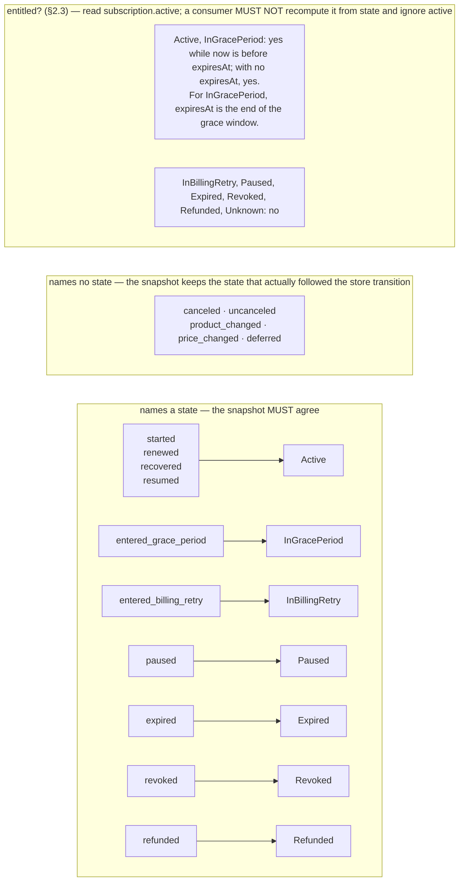
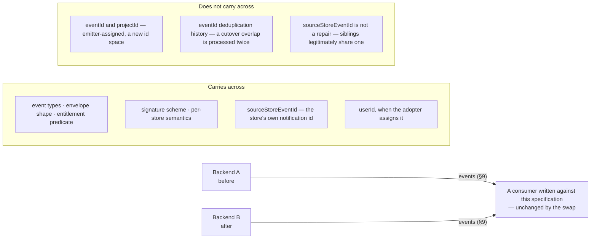

# OpenIAP Commerce Protocol Specification 1.0

A vendor-neutral contract for the **server side** of in-app purchases: one
normalized commerce vocabulary, one portable operation surface with REST and
GraphQL bindings, one event envelope, one webhook contract.

A consumer that implements this specification can process subscription starts,
renewals, subscription refunds, and entitlement changes from Apple, Google,
Meta Horizon, and Amazon **without parsing a single store-native payload** and
without knowing which backend produced the event. A developer backend written
against the operation surface can verify purchases, read entitlements, bind
purchases to its own users, and erase them — and later replace the provider
behind those calls without rewriting the integration.

## Why this exists

OpenIAP normalizes the client-side purchase API across stores. The server side
has the same fragmentation and no equivalent answer. Each store expresses
validation, renewal, cancellation, expiration, refund, revocation, entitlement,
and server notifications differently, so every backend, analytics pipeline, and
integration re-learns four protocols and re-derives the same semantics — usually
with subtly different answers.

This specification defines that shared server-side layer.

## What this is not

- **Not a product.** It specifies a contract, not a paywall builder,
  experimentation platform, CRM, or analytics engine. Those consume this; they
  are not built inside it.
- **Not tied to one implementation.** IAPKit is the open-source reference
  implementation, not the standard. Any backend may implement this
  specification, in any language, without importing IAPKit.
- **Not a client API.** Client-side purchase flow is OpenIAP's domain. Where a
  concept exists on both sides, this document says so explicitly.

Naming, since the two are easy to confuse: **OpenIAP Commerce Protocol** is
this standard. **IAPKit** is its open-source reference implementation and a
hosted service built on it. Package and artifact names follow the protocol;
IAPKit is not normative.

## No central dependency

This specification is a contract between two parties. It does not place a third
one in the middle.

An emitter MUST be able to produce conformant events, and a consumer to verify
and process them, with **no network request to infrastructure operated by the
OpenIAP project**, at build or run time. Specifically:

- No OpenIAP account, registration, or issued identifier. Every identifier here
  is assigned by the emitter.
- No OpenIAP-issued credential. The webhook secret is exchanged directly
  between emitter and consumer; see §9.4.2.
- No commerce data reaches the OpenIAP project under any rule in this document.
- Validation runs offline: the bundle schema resolves no external reference.
- Conformance is demonstrated against this package's fixtures and vectors, not
  by routing production traffic anywhere.

## Conformance language

`MUST`, `MUST NOT`, `SHOULD`, and `MAY` are used as defined in RFC 2119.

Four roles are addressed:

| Role         | Who                                       | Obligation                                                                 |
| ------------ | ----------------------------------------- | -------------------------------------------------------------------------- |
| **Provider** | A backend that serves protocol operations | Serve the declared profiles over at least one binding and pass conformance |
| **Caller**   | Anything that invokes an operation        | Honour the auth roles, error model, and forward-compatibility rules        |
| **Emitter**  | A backend that produces commerce events   | Produce documents valid against the schemas and honour the transport rules |
| **Consumer** | Anything that receives them               | Honour the verification, idempotency, and forward-compatibility rules      |

A provider is usually also an emitter, and a caller usually also a consumer;
the roles stay separate because each pair carries different obligations.

## Machine-readable artifacts

This document and the GraphQL contract together define the protocol. The
contract is authored as the layers in `schema/`, assembled into the single file
`commerce-protocol.graphql`; it is authoritative for wire structure, the
operation surface, member presence and nullability, and per-member definitions.
This document is authoritative for domain behavior, cross-field rules,
transport, and compatibility. The generated JSON Schema bundle is the
executable projection validators consume.

| Artifact                                                 | Purpose                                                                                      |
| -------------------------------------------------------- | -------------------------------------------------------------------------------------------- |
| `schema/`                                                | The authored GraphQL contract layers — edit these                                            |
| `generated/commerce-protocol.graphql`                    | Generated single-file assembly of `schema/`; exported at `./commerce-protocol.graphql`       |
| `generated/`                                             | Compiler output. Ignore this directory when reviewing the authored contract                  |
| `generated/schemas/commerce-protocol.bundle.schema.json` | Self-contained validator; prefer it in validator integrations                                |
| `generated/schemas/*.schema.json`                        | Generated modular JSON Schema artifacts                                                      |
| `examples/`                                              | Canonical documents that MUST validate                                                       |
| `examples/store-event-mapping.json`                      | How each store's own notification vocabulary maps onto these event types                     |
| `vectors/signatures.json`                                | Signature vectors every implementation MUST reproduce                                        |
| `generated/vectors/lifecycle.json`                       | Generated entitlement, first-binding, and event-emission vectors implementations reproduce   |
| `generated/bindings/http-binding.json`                   | Generated HTTP manifest: method, path, auth role, statuses, and schema pointer per operation |
| `generated/bindings/operations.graphql`                  | Generated executable GraphQL projection the GraphQL binding serves                           |
| `generated/bindings/graphql-operations.json`             | Generated canonical full-selection GraphQL documents                                         |
| `generated/openapi/commerce-protocol.openapi.json`       | Generated OpenAPI 3.1 document for the REST binding                                          |
| `generated/vectors/operations.json`                      | Generated operation conformance vectors                                                      |
| `conformance/`                                           | The portable conformance runner and its independent mock provider                            |

---

## 1. Scope and architecture

### 1.1 Architecture

The protocol fixes two boundaries around a backend, and the backend behind them
is replaceable.

```text
Apple / Google / Meta / Amazon        the stores
        │
        │  store-native notifications and APIs
        ▼
┌─────────────────────────────────────────────┐
│  A backend that implements this spec        │   ← IAPKit, another provider,
│                                             │     or the adopter's
│  verify → normalize → lifecycle → entitle   │     own, in any language
└─────────────────────────────────────────────┘
   ▲    │
   │    │  OpenIAP Commerce Protocol events (§9)   → any consumer:
   │    ▼                                            analytics, subscriber
   │  data pipeline / CRM / analytics                experience, data pipeline
   │
   │  operations (§4): verify, status, entitlements,
   │  bind, erase, capabilities — over REST (§6) or GraphQL (§7)
   ▼
developer backend / app
```

Two things are specified, both replaceable behind a provider swap:

- **The operation surface (§4–§8).** A caller verifies purchases, reads
  entitlements, binds purchases to its own users, and erases them, over either
  transport binding, against whichever backend implements the protocol.
- **The event on the outbound arrow (§9)**, and — for the store notifications
  named in §9.2 — the normalized meaning an emitter assigns before sending it.

How the backend receives and verifies store facts, which other store APIs it
calls, what it stores, and how it scales remain implementation. A caller written
against these two surfaces does not change when the backend behind them does.

## 2. Core domain model

### 2.1 Conventions

**Timestamps** are integer milliseconds since the Unix epoch, UTC. The single
exception is the transport signature timestamp, which is in **seconds** — see
§9.4.2. That inconsistency is inherited from the deployed 1.0 wire format and is
recorded rather than silently corrected.

**Money** is `{ currency, amountMicros, provenance }`. `amountMicros` is an
integer in millionths of one currency unit, so `1.99 USD` is `1990000`.
Currency is an uppercase ISO 4217 code. `amountMicros` is always a non-negative
magnitude; the event type supplies direction. On a refund event it still says
what the purchase cost, not how much the store returned (§14).

> An absent amount means **unknown**. It never means zero. A consumer that
> treats a missing amount as `0` will under-report revenue.

`provenance` says where the number came from, and the three values are not
interchangeable:

| Value      | Meaning                                                                                                                                                                                                    |
| ---------- | ---------------------------------------------------------------------------------------------------------------------------------------------------------------------------------------------------------- |
| `store`    | The store asserted this amount in a signed notification or an authoritative API response. Only this value is safe to treat as financially authoritative.                                                   |
| `catalog`  | Resolved from the emitter's own product catalog because the store asserted nothing. It is the list price, not necessarily what the customer paid — promotions, regional pricing, and taxes can all differ. |
| `inferred` | Derived by the emitter from other fields. Usable for estimates, never for reconciliation.                                                                                                                  |

An emitter MUST NOT present a `catalog` or `inferred` amount as `store`. A
consumer doing revenue reconciliation SHOULD accept only `store`.

**Identifiers** are opaque strings. A consumer MUST NOT parse structure out of
one.

**Enumerations** are closed unless this document says otherwise. Four value
spaces are deliberately open — `environment` here, `store` below,
`cancellationReason` on the subscription snapshot, and `eventType`, which §12
grows in a MINOR version — and a consumer MUST tolerate a value it does not
recognise in any of them, and MUST NOT act on one it does not know.

**Store, not platform.** This specification keys on `store`, never on device
platform. One device platform can host several stores — an Android build can
ship against Google Play, Amazon Appstore, or Meta Horizon — so platform does
not identify the authority for a purchase.

The store value space is **open**. This version names `apple`, `google`,
`horizon`, and `amazon`, but the contract MUST NOT be read as closing the set:
an implementation observing commerce on another platform is free to emit it, and
a consumer MUST accept and preserve an unrecognised store opaquely rather than
reject the event. Which stores a given backend integrates is its own business —
the point is that no release of this document stands between an adopter and a
platform they need.

### 2.2 The four things that are not the same

Conflating these is the most common server-side commerce bug. They are distinct,
and each answers a different question.

| Concept          | Question it answers                          | Nature                               |
| ---------------- | -------------------------------------------- | ------------------------------------ |
| **Transaction**  | What economic event did the store record?    | An immutable fact                    |
| **Subscription** | What is the current arrangement?             | Mutable state                        |
| **Event**        | What changed, and when?                      | An immutable fact about a transition |
| **Entitlement**  | What may this customer access **right now**? | A derived predicate                  |

A subscription has one **state** at a time. A **transition** between states
produces an **event**. **Entitlement** is computed from state and time, and is
neither of the other two.

#### Subscription state

`Active`, `InGracePeriod`, `InBillingRetry`, `Paused`, `Expired`, `Revoked`,
`Refunded`, `Unknown`.

`Unknown` means the emitter could not classify the subscription — typically
because it was bootstrapped from a receipt rather than from a lifecycle
notification. It does not mean the state machine is uncertain.

`cancellationReason` is an optional, advisory token. This version names
`UserCanceled`, `BillingError`, `PriceIncreaseDeclined`, `ProductUnavailable`,
`Refunded`, and `Other`, but the value space is open. A consumer MUST tolerate
an unrecognised token and MUST NOT use this field as a billing or reporting fact:
unlike `price`, it carries no provenance.

### 2.3 Entitlement

Entitlement is carried as `subscription.active`, and where a `subscription`
member is present that is the field to read — never a re-derivation from
`state`. A store that keeps no canonical subscription record sends no snapshot;
there the `entitlement.*` event type itself carries the decision (§9.5).

**Entitlement is not derivable from `state` alone**, and this is where naive
implementations go wrong:

> A customer who cancels keeps access until the end of the period they already
> paid for. `subscription.canceled` means _auto-renew was turned off_. It does
> **not** mean access was revoked.

The normative predicate is:

| State                            | Entitled?                                                                                                               |
| -------------------------------- | ----------------------------------------------------------------------------------------------------------------------- |
| `Active`                         | Yes, while `now < expiresAt`                                                                                            |
| `InGracePeriod`                  | Yes, while `now < expiresAt` — where `expiresAt` is the end of the grace window, not of the period that failed to renew |
| `InBillingRetry`                 | No — the store is retrying billing and access is suspended                                                              |
| `Paused`                         | No                                                                                                                      |
| `Expired`, `Revoked`, `Refunded` | No                                                                                                                      |
| `Unknown`                        | No                                                                                                                      |

When `expiresAt` is present, `now == expiresAt` is **not** entitled: the
boundary is exclusive. When it is **absent**, no deadline is known and the state
alone decides — an `Active` or `InGracePeriod` subscription with no `expiresAt`
is entitled.

An emitter MUST set `subscription.active` to the result of this predicate as
evaluated at `processedAt` — the moment it derived the event, not the moment the
store's fact occurred. The two differ only when a notification is processed
after the entitlement boundary has passed, and there the later answer is the
safe one: a grace window that has since closed must not be reported as still
granting access. A consumer MUST NOT recompute entitlement from `state` and
ignore `active`.

`active` is therefore a snapshot at `processedAt`, not a promise about the later
delivery instant. When applying `active: true`, a consumer MUST NOT grant access
beyond a present `expiresAt`; it either schedules that deadline or re-reads an
authoritative status before then. A delivery received at or after `expiresAt`
MUST NOT open the gate. An absent `expiresAt` carries no deadline, so a consumer
that requires freshness beyond the event stream needs an emitter-specific
status source.

> **Do not confuse this with purchase-validation verdicts.** A synchronous
> receipt-validation result answers "is this receipt currently valid?" and has
> its own vocabulary in which a cancelled purchase is invalid. That is a
> different axis from subscription lifecycle state, where a cancelled
> subscription is still entitled until it expires. The same English word means
> opposite things on the two surfaces; they MUST NOT be merged.

### 2.4 Identity

`projectId` identifies the emitter-side **scope** — whatever boundary the
emitter organises commerce by. For a multi-tenant backend that is a tenant; for
a single company's own backend it may be one constant. It is not issued by any
registry, and an implementation MUST NOT be required to obtain one from a third
party. The member name is inherited from the deployed 1.0 wire format;
`applicationId` is an optional finer scope within it. Both are opaque.

`userId` is the app user the purchase is bound to, expressed in the identity
space **shared by the emitter and its consumer**. There is no global user
directory and no central identity resolution: the value only has to mean the
same thing to those two parties. It is absent when no binding exists, and this
specification defines no account-merge semantics — a purchase can be observed
before any user is known.

An `entitlement.*` event is an actionable access decision, so it MUST carry both
`userId` and `productId`. An emitter that has not bound a purchase to a user may
emit a lifecycle event, but MUST defer the entitlement decision until the
binding exists.

At first binding, the emitter MUST coalesce all unbound gate changes into the
gate's **current** value, evaluated at the binding event's `processedAt`. The
unbound baseline is not entitled: emit one `entitlement.granted` if the current
predicate is true, and emit no entitlement event if it is false. An emitter MUST
NOT replay an historical grant or revoke whose result is no longer current. A
grant uses the occurrence value §9.3 assigns to the latest transition or
observation that established the current gate. An emitter that retains no
attributable occurrence MAY defer the grant to its next store observation
rather than invent source facts; until that observation arrives the consumer
has no entitlement event, so an emitter SHOULD retain enough of the
originating occurrence to grant at binding. `processedAt` records when the
bound event was derived. `generated/vectors/lifecycle.json` pins the coalescing
cases, including a grant that expired before binding.

`transactionId` and `originalTransactionId` carry store-side transaction
identity **where the store exposes it**. Neither is universally available:
Google Play does not put one in a subscription notification — an emitter that
wants it must read the store's subscription API — and Meta
Horizon exposes no transaction identity at all. A consumer MUST NOT require
them.

## 3. Profiles

The protocol is a small core plus named profiles, so a provider can be honest
about what it serves and a caller can branch on declarations instead of
guessing.

**Core** is not a profile; every provider carries it: the domain model (§2),
the portable error model (§8), the capability descriptor and its
`providerCapabilities` operation (§10), and the versioning rules (§12).

| Profile            | Operations                           | Obligations                                                                                  |
| ------------------ | ------------------------------------ | -------------------------------------------------------------------------------------------- |
| `verification`     | `verifyPurchase`                     | Verify store evidence under §4.1 without touching any account                                |
| `entitlements`     | `subscriptionStatus`, `entitlements` | Serve tokenless, fail-close server reads under §4.2 and §4.3                                 |
| `events`           | none                                 | Emit and deliver normalized events under §9 — taxonomy, envelope, signature, and retry rules |
| `accountLifecycle` | `bindPurchase`, `eraseUser`          | Bind purchases to caller-owned identities and erase them under §4.4 and §4.5                 |

Profile membership is declared in the SDL and generated into the HTTP
manifest; the four names above are this version's, and the space is open —
a consumer MUST ignore a profile name it does not recognise.

A provider implements a profile **completely or not at all**. It MUST declare
in its capability descriptor (§10) every profile it serves and MUST NOT
declare one it serves partially or does not pass conformance for (§11).
Profiles version independently as MAJOR.MINOR; a caller pins on the major.

---

## 4. Operations

Six operations make up the 1.0 surface. `commerce-protocol.graphql` is
authoritative for their input and result structure; this section is
authoritative for their behavior. Rules that apply to every operation:

- **One input, one result.** An operation takes at most one `input` document
  and returns one result document or one protocol error (§8).
- **Omission means unknown.** A provider that cannot determine an optional
  result member MUST omit it, never send a placeholder — the same rule §12
  states for events. Operation types never combine nullable with omittable,
  so the two bindings cannot disagree about what an absent member means.
- **Idempotency.** Every 1.0 operation is idempotent: repeating a call with
  the same input yields the same outcome, apart from members the operation
  documents as progressing (an erasure job's `status`). A caller MAY retry on
  timeout without a dedicated idempotency key.
- **Fail-close.** A provider that cannot answer completely — a partial read,
  an overflowing record set, an unclassifiable state — MUST fail the
  operation rather than answer from what it has.
- **Provider time.** Entitlement gates are evaluated at the provider's own
  read time. A caller-supplied timestamp is never an input to an access
  decision.
- **Unknown input members.** The REST binding ignores an input member it does
  not recognise, which is what makes a MINOR input addition safe (§6). The
  GraphQL binding rejects one at validation instead (§7); GraphQL callers
  regenerate against the published schema.

### 4.1 verifyPurchase

Verifies store evidence and returns a verdict. The evidence union is
discriminated on the open `store` space: for each store this version names,
the matching evidence member is required, and a provider MUST reject a store
it does not integrate with `UNSUPPORTED_STORE` rather than failing schema
validation — a future store is a MINOR addition, not a break.

`isValid` is the acceptance gate and the only one: `state` is advisory detail
in an open token space, and a caller MUST NOT re-derive acceptance from it.
Store rejection of the evidence is a **successful** operation whose result
says `isValid: false`; `VERIFICATION_FAILED` is reserved for the provider
failing to obtain a verdict at all. A verification verdict is the
purchase-validation axis §2.3 warns about — it is not subscription lifecycle
state.

Verification is account-free. It binds no user, reads no account, and is
callable with the verification role (§5), so a shipped app can hold the
credential that calls it. A provider MUST NOT let this operation, or any
input to it, select or mutate account state.

### 4.2 subscriptionStatus

A developer backend reads one user's subscription standing: an `active` gate
for the user as a whole, plus the most relevant record — the current
entitling subscription when one exists, otherwise the provider's most recent
record as context, and no record member at all when the provider has none.

The snapshot is **tokenless by construction**: no purchase token, store
transaction identity, signed receipt, or provider-internal record identifier
appears in it. Server role only — a verification credential MUST be refused,
because with it a shipped app could walk arbitrary user identities.

### 4.3 entitlements

The access decision for one user: every product whose gate is open at the
provider's read time, with the entitling records. Unknown, expired, and
ambiguous records contribute nothing. The same tokenless and server-role
rules as §4.2 apply.

### 4.4 bindPurchase

Connects verified store evidence to the caller's own opaque user identity —
the identity space of §2.4. Server role only: token possession is
deliberately not proof of ownership, so binding is a decision the caller's
authenticated backend makes, never a shipped app.

Binding is idempotent and never moves an existing binding. `bound: false`
covers every non-binding outcome — unknown evidence, evidence bound to a
different user, a store the provider cannot bind — without distinguishing
them, so the operation cannot probe whether someone else's purchase exists.
How a provider recovers a purchase bound to the wrong user is management
plane, outside this contract.

### 4.5 eraseUser

Removes a user identity from the provider's subscription records and from its
protocol event identity. Server role only. The operation acknowledges with
`accepted` and, where the provider processes erasure as a job, a `jobId` and
an open-space `status`; re-requesting the same user is idempotent and reports
the current job.

Erasure is bounded by physics: a provider erases **its own** records and
event store. It CANNOT unsend events, so copies already delivered to the
caller's systems are the caller's own responsibility to erase — a provider
MUST NOT claim otherwise.

### 4.6 providerCapabilities

Returns the capability descriptor (§10). No credential, no commerce data,
and no central registry: the answer is self-describing and a conformance
runner reads it the same way a caller does.

---

## 5. Authentication and trust

The protocol standardizes **roles and rules**, not credential formats. How a
provider issues, names, or rotates credentials is its own business; no
prefix, length, or issuer is part of this contract.

| Role             | Holder                             | May call                                             |
| ---------------- | ---------------------------------- | ---------------------------------------------------- |
| **verification** | May ship inside an application     | `verifyPurchase`, `providerCapabilities`             |
| **server**       | The caller's authenticated backend | Everything the verification role may, plus §4.2–§4.5 |
| _operator_       | Whoever administers the provider   | Management plane — outside the portable contract     |

Both bindings MUST enforce:

- Credentials travel in the `Authorization` header. A provider MUST NOT
  accept a secret in a URL path or query string, where proxies and logs
  retain it.
- Auth failures fail close: no credential is `UNAUTHORIZED`, a credential of
  the wrong role is `FORBIDDEN`, and neither response reveals whether the
  target of the call exists.
- For an operation that requires the **server** role, authorization precedes
  input validation: a caller without a valid server credential MUST receive
  `UNAUTHORIZED` or `FORBIDDEN`, never a verdict about its input — an
  input-validation answer would let an unauthenticated caller map the
  privileged surface (which stores bind, which members exist, which bounds
  apply). Transport-shape failures — an unparseable or oversized body, or a
  GraphQL document that fails parsing or validation — MAY still precede
  authorization: they say nothing operation-specific. Variable coercion
  against the operation input IS input validation, not transport shape — a
  GraphQL engine coerces variables before any resolver runs, so a provider
  that authorizes only inside resolvers violates this rule and MUST
  authorize the operation before executing the document. Verification-role
  operations are exempt
  because their input schema is the published client contract an application
  already ships with.
- The verification role and the server role are distinct credentials. A
  provider MUST NOT let a verification credential reach an account read or
  mutation, which is what blocks arbitrary-`userId` lookups from shipped
  apps.
- A provider MAY rate-limit any operation. It signals with `RATE_LIMITED`
  and SHOULD send `Retry-After` seconds on the REST binding.
- 1.0 defines no pagination: no operation returns an unbounded collection,
  and §4's fail-close rule covers a record set a provider cannot bound. A
  future paginated operation defines its cursor semantics when it is added.

---

## 6. REST binding

The REST binding serves every operation under the versioned `/commerce/v1`
namespace, described end to end by two generated artifacts: the HTTP manifest
(`generated/bindings/http-binding.json`) and the OpenAPI 3.1 document. Both
are compiled from the SDL — neither is authored, so neither can drift from
the contract.

Per operation the manifest fixes: HTTP method (`GET` for queries, `POST` for
mutations), path, auth role, success status, idempotency, the error codes it
may return, and JSON Schema pointers for its input and result inside the
offline bundle.

- A `GET` operation carries its input as query parameters; every such input
  member is a scalar by construction (the compiler rejects anything else).
  Opaque identifiers are not secrets (§5 keeps credentials out of URLs), but
  a deployment that must keep user identifiers out of intermediary logs
  should note that they ride the query string here.
- A `POST` operation carries its input as a JSON body with
  `Content-Type: application/json`.
- Success is exactly the operation's `successStatus`. Every failure returns
  the status §8 assigns to its code, with a `ProtocolErrorResponse` body.
- An unrecognised input member is ignored (§4), and a caller MUST ignore
  unrecognised result members — the same open-object rule the event envelope
  follows.

### 6.1 Default paths

| Operation              | Method | Path                                |
| ---------------------- | ------ | ----------------------------------- |
| `providerCapabilities` | GET    | `/commerce/v1/capabilities`         |
| `subscriptionStatus`   | GET    | `/commerce/v1/subscriptions/status` |
| `entitlements`         | GET    | `/commerce/v1/entitlements`         |
| `verifyPurchase`       | POST   | `/commerce/v1/purchases/verify`     |
| `bindPurchase`         | POST   | `/commerce/v1/purchases/bind`       |
| `eraseUser`            | POST   | `/commerce/v1/users/erase`          |

A provider serves these paths relative to a base URL it documents. The path
segment `v1` is the protocol major version, so a future major can be served
beside this one.

---

## 7. GraphQL binding

The GraphQL binding serves the same six operations at one HTTP endpoint —
IAPKit serves `/commerce/v1/graphql`, and a provider documents its own — as
an executable schema that MUST define everything the generated projection
(`generated/bindings/operations.graphql`) defines, exactly as it defines it;
a newer compatible MINOR may extend it additively (§12), never alter it.
Introspection, where enabled, MUST agree with the schema served; the
projection contains no secret, so there is no reason to hide it, and a
provider MAY still gate introspection behind a credential.

- Requests are `POST` with the standard `{query, operationName, variables}`
  JSON body, the operation input passed as the `input` variable. The same
  credentials travel in the same `Authorization` header, and the same role
  rules apply (§5).
- **No Subscription root, ever.** The operation surface is bounded
  request/response; a GraphQL subscription is a stream a shipped app could
  hold open, which the webhook direction rule (§9.4) forbids. The compiler
  rejects a `Subscription` type in the SDL.
- An operation failure is an HTTP `200` whose `errors[*].extensions.code`
  carries the §8 code — any error that carries a protocol code MUST be
  delivered at `200`. This includes a refusal decided before execution,
  such as an authorization or rate-limit rejection; a pre-execution refusal
  omits the `data` member.
- A request-level failure — the document or variables themselves could not
  be processed: unparseable document, validation failure, variable coercion
  — MAY carry no protocol code or MAY carry the generic `INVALID_REQUEST`,
  never a more specific code. The two categories are exclusive per envelope:
  one `errors` array is either all coded or all codeless — a codeless entry
  riding beside coded ones would be invisible to every code check. It omits the `data` member entirely, and only
  the codeless form MAY be delivered as HTTP `400` instead of `200`. A
  caller treats either form as `INVALID_REQUEST`; only where the request
  died differs.
- GraphQL cannot express omitted-versus-null on a selected member: a member
  the provider omitted comes back as `null`. Operation types therefore never
  make `null` meaningful (the compiler rejects a nullable omittable member),
  and a caller normalizes `null` to absent. On input, an explicit `null` for
  an omittable member means absent.
- A provider MAY bound query depth, size, or aliasing, but MUST accept the
  canonical documents (`generated/bindings/graphql-operations.json`) — they
  are the deepest selections the contract can produce.
- Business logic MUST NOT live in resolvers. Resolvers adapt transport;
  §11's parity requirement exists to make a divergent resolver visible.

---

## 8. Portable errors

One open code space serves both bindings; the wire wrapper differs, the
meaning MUST NOT. REST wraps a failure as
`{ "error": { "code", "message" } }` with the mapped status; GraphQL carries
the code in `errors[*].extensions.code` (§7). A message is human-readable
and MUST NOT contain credentials, store evidence, signed payloads, stack
traces, or implementation source paths.

| Code                  | HTTP | Meaning                                                                      |
| --------------------- | ---- | ---------------------------------------------------------------------------- |
| `INVALID_REQUEST`     | 400  | The input is malformed or fails the operation schema                         |
| `UNAUTHORIZED`        | 401  | No usable credential was presented                                           |
| `FORBIDDEN`           | 403  | The credential's role may not call this operation                            |
| `NOT_FOUND`           | 404  | The addressed resource does not exist                                        |
| `PURCHASE_NOT_FOUND`  | 404  | The evidenced purchase is unknown, where an operation distinguishes that     |
| `CONFLICT`            | 409  | The request contradicts current state                                        |
| `UNSUPPORTED_STORE`   | 422  | The provider does not integrate the named store                              |
| `RATE_LIMITED`        | 429  | Too many requests; retry after the signalled delay                           |
| `INTERNAL_ERROR`      | 500  | The provider failed internally                                               |
| `UNSUPPORTED_PROFILE` | 501  | The operation belongs to a profile this provider does not serve              |
| `VERIFICATION_FAILED` | 502  | The provider could not obtain a verdict — never the store rejecting evidence |

The space is open: a MINOR version can add a code, so a caller MUST treat an
unrecognised code as a failure of the operation rather than a protocol
violation. The generated manifest carries this same table as
`errorStatus`; the test suite keeps the two in exact agreement.

---

## 9. Event delivery

The asynchronous half of the protocol: what an emitter says happened, and
how it reaches a consumer. Everything in this section is the Event
Delivery profile (§3); its rules bind any implementation that declares
`events`, whether or not it serves the operation surface.

### 9.1 Event taxonomy

Two families of event type, listed in full below and named as examples in the
generated event schema. The value space remains open so a MINOR version can add
a type. The known taxonomy is deliberately small: it covers exactly the
transitions at least one store can actually report, and nothing speculative.

### Subscription lifecycle

| Event                                | Meaning                                                                                                                                                                                                                                                                  |
| ------------------------------------ | ------------------------------------------------------------------------------------------------------------------------------------------------------------------------------------------------------------------------------------------------------------------------ |
| `subscription.started`               | The emitter began a new subscription record, including a resubscription for which it has no earlier store history                                                                                                                                                        |
| `subscription.renewed`               | A billing period completed and another began                                                                                                                                                                                                                             |
| `subscription.recovered`             | An existing subscription record is live again — billing succeeded after a failure, a customer resubscribed, or a refund was reversed. A consumer measuring dunning recovery specifically MUST NOT count this event alone; §9.2 says which store notification produced it |
| `subscription.entered_grace_period`  | Billing failed; access retained while the store retries                                                                                                                                                                                                                  |
| `subscription.entered_billing_retry` | Billing failed; access suspended while the store retries                                                                                                                                                                                                                 |
| `subscription.expired`               | The subscription ended                                                                                                                                                                                                                                                   |
| `subscription.canceled`              | Auto-renew was turned off; access continues until the period ends                                                                                                                                                                                                        |
| `subscription.uncanceled`            | Auto-renew was turned back on before the period ended                                                                                                                                                                                                                    |
| `subscription.revoked`               | The store withdrew the purchase                                                                                                                                                                                                                                          |
| `subscription.refunded`              | The purchase was refunded                                                                                                                                                                                                                                                |
| `subscription.product_changed`       | The subscription moved to a different product                                                                                                                                                                                                                            |
| `subscription.price_changed`         | The renewal price changed                                                                                                                                                                                                                                                |
| `subscription.deferred`              | The next billing date was pushed out without a product change                                                                                                                                                                                                            |
| `subscription.paused`                | The subscription was paused                                                                                                                                                                                                                                              |
| `subscription.resumed`               | A paused subscription resumed                                                                                                                                                                                                                                            |

The state each lifecycle event names, as the GraphQL contract enforces it. The
specification says where an event lands, not where it came from:



### Entitlement delta

| Event                 | Meaning                 |
| --------------------- | ----------------------- |
| `entitlement.granted` | Access became available |
| `entitlement.revoked` | Access was withdrawn    |

An emitter MUST emit an entitlement event **only when the gate actually flips** —
that is, when the entitlement predicate's result differs from its result before
the transition. Emitting one alongside every lifecycle event would make the
signal useless for access control.

An entitlement event carries `userId` and `productId` (§2.4). If it includes a
subscription snapshot, `entitlement.granted` requires `active: true` and
`entitlement.revoked` requires `active: false`.

When a subscription snapshot is present, its state MUST agree with lifecycle
events that name a state: `started`, `renewed`, `recovered`, and `resumed` use
`Active`; `entered_grace_period` uses `InGracePeriod`;
`entered_billing_retry` uses `InBillingRetry`; and `expired`, `revoked`,
`refunded`, and `paused` use their corresponding states. The GraphQL contract
enforces these pairs. Events such as cancellation and product or price changes
do not name a state and therefore retain the state that actually followed the
store transition.

A transition that changes nothing — a redelivered notification, a no-op update —
MUST emit no event at all. Otherwise consumers count retries as activity.

### 9.2 Where the events come from

`examples/store-event-mapping.json` gives the normalization table: each store's
own notification type, and the event it becomes. An implementer follows it
instead of reverse-engineering an existing backend.

Four properties of that table are worth stating here, because they are easy to
get wrong:

- **A notification can map to nothing.** An audit-only or informational
  notification — a delivery test, a pause-schedule metadata update, a consent
  change — is received, acknowledged, and emits no event. That is a mapping, not
  a gap, and each such row carries its reason.
- **One notification type usually means more than one thing.** Three kinds of
  qualifier separate them, and a row carries whichever applies:
  - a **subtype** the store sends — Apple marks a recovery from billing failure
    with `BILLING_RECOVERY` on the same `DID_RENEW` it uses for an ordinary
    renewal;
  - the subscription's **prior state** — Google sends `SUBSCRIPTION_RECOVERED`
    for both a recovery and a resume from pause and marks nothing, so only the
    state before the event separates them (`whenPreviousState`);
  - whether the emitter has **any store history** for the purchase
    (`whenNoPriorStoreEvent`). This one is easy to miss and changes the answer
    often: a notification about a purchase the emitter has never heard from the
    store before begins the story, while the identical notification about a
    purchase it has been tracking continues one. Note the axis is store history,
    not record existence — a purchase learned from a client receipt but never
    from the store still begins the story.

  An implementation MUST prefer a qualified row over the unconditional one. A
  row never carries both `whenNoPriorStoreEvent` and `whenPreviousState`; the
  first says there is no history to have a state in, the second says what that
  state was.

  Selection is deterministic. A row's wire key is `storeNotificationCode` when
  present, otherwise `storeNotification`; first retain rows whose key equals the
  received notification value. Then prefer an exact `storeSubtype`. If no exact
  subtype row exists, use the row whose subtype is absent or null. Within that
  pair, prefer a matching history or prior-state condition over the
  unconditional row. If no row matches, acknowledge the notification and emit
  nothing; an emitter MUST NOT guess a lifecycle event.

- **The store's own wire value is `storeNotificationCode` where it differs from
  the name.** Google Play transmits a number; `SUBSCRIPTION_RENEWED` is a
  documentation label that never appears on the wire. Apple transmits the name.
- **Entitlement events are never mapped.** They are derived from the gate
  flipping, so no store notification produces one directly.

### 9.3 The event envelope

Full structure in `commerce-protocol.graphql`; its generated validator is
`generated/schemas/commerce-event.schema.json`. Required members:
`eventId`, `eventType`, `eventVersion`, `occurredAt`, `processedAt`, `store`,
`environment`, `projectId`. An entitlement event additionally requires `userId`
and `productId` (§2.4).

`occurredAt` is the best authoritative time for the commerce fact. For a store
notification or API response that supplies the transition time, it is that
store-asserted time. If a poll reveals only that a value changed since the last
observation, it is the time the emitter observed the new value; an emitter MUST
NOT invent or interpolate a more precise instant. That fallback is an
observation boundary, not a claim about the exact store transition.

`processedAt` is when the emitter derived the event. It can differ from
`occurredAt` by hours after an outage. Consumers use `occurredAt` for the
portable business ordering described in §9.4.4, while recognising that a
poll-derived value orders observations rather than reconstructing an unknown
instant inside the polling interval.

**`price` is context, not a charge record, and events are not summable.** Stores
repeat the subscription's amount on notification after notification: one Apple
subscription that renews, is cancelled, then lapses produces three events all
carrying the same figure. Within a single notification the amount also rides
exactly one event — the lifecycle event where there is one, otherwise the
entitlement event — so it is never duplicated by the entitlement delta. But
across notifications it recurs by design.

A consumer computing revenue therefore MUST NOT add up every event that has a
`price`. `subscription.started`, `subscription.renewed`, and
`subscription.recovered` can represent positive revenue, but a consumer SHOULD
book them only when `provenance` is `store`. `subscription.refunded` says a
reversal occurred, but 1.0 carries no returned amount, so a consumer MUST NOT
debit `price.amountMicros` as though it were the refund amount. It must reconcile
the amount through store-authoritative data. Every other event carries `price`
only as context. `subscription.revoked` is not a reversal: it withdraws access,
and whether money moved with it is a fact the stores do not always report.

`eventId` is the deduplication key, and the only one. A `transactionId` cannot
serve as a second: Play subscription notifications carry none at all, and where a
store does issue one it repeats it across the charge, the refund that reverses
it, and the re-charge that reverses the refund — which a reversal of an
already-recovered charge collapses onto one event type as well. §9.1 already
requires an emitter not to re-emit an unchanged fact, so a second key defends
against a violation of that rule rather than against anything this contract
permits.

`sourceStoreEventId` carries the **store's own** notification identifier — an
App Store `notificationUUID`, a Play RTDN `messageId` — so support can
cross-reference against the store console. It is not the emitter's own row
identifier, and an emitter MUST NOT place internal record identifiers in it.

`extensions` is the escape hatch for store-specific detail with no canonical
equivalent. It is flat, string-valued, and bounded at 24 entries, 64-character
keys, and 512-character values. Its content is provider-influenced: a consumer
MUST treat every value as untrusted input.

An emitter MUST NOT place credentials, raw store payloads, signed receipts, or
personal data beyond the identifiers above into any member.

### 9.4 Webhook contract

Direction is **store → backend → consumer**, server-to-server in both hops.

This specification defines **no** backend-to-client stream. There is no SSE
endpoint, WebSocket, push relay, or long-poll feed for shipped applications: a
project-wide event feed and its signing secret must never reach a distributed
app. An application that needs device push gets it from its own authenticated
backend, downstream of this contract.

One delivery, end to end. §9.4.1–9.4.4 below state each step normatively:

```mermaid
sequenceDiagram
  participant Store
  participant Emitter as Backend (emitter)
  participant Consumer as Consumer endpoint

  Note over Emitter,Consumer: Delivery is duplicate-capable and unordered, with no exactly-once guarantee (§9.4.4). This is one attempt.

  Store->>Emitter: store-native notification
  Emitter->>Emitter: normalize (§9.2); derive the lifecycle and entitlement events (§9.1)
  Emitter->>Consumer: POST to the consumer's HTTPS URL — Content-Type: application/json, no Content-Encoding<br/>body: one event, the exact UTF-8 bytes<br/>openiap-signature: v1=lowercase hex (several, comma-separated, during rotation)<br/>openiap-timestamp: exactly one, Unix seconds, base-10, no sign<br/>openiap-event-id · openiap-delivery-id
  Note over Consumer: MUST: reject if abs(now − timestamp) > 300 s<br/>MUST: signed = ascii(timestamp) + "." + the exact body bytes received; HMAC-SHA256 with the shared secret<br/>MUST: split openiap-signature on "," and trim; accept if any presented v1= matches any valid secret, compared in constant time<br/>MUST: take eventId from the parsed body, not the header; be idempotent on it<br/>SHOULD: acknowledge before slow downstream work
  alt 2xx
    Consumer-->>Emitter: 2xx
    Note over Emitter: delivered
  else 408, 429, 5xx — or no response (timeout, connection error)
    Consumer-->>Emitter: 408 / 429 / 5xx, or nothing
    Note over Emitter: retry with exponential backoff: same body and eventId, fresh openiap-timestamp,<br/>recomputed signature, same openiap-delivery-id; eventually stop and dead-letter
  else 3xx, or any other 4xx
    Consumer-->>Emitter: 3xx / other 4xx
    Note over Emitter: permanent failure — a redirect is not followed, nothing is retried
  end
```

#### 9.4.1 Request

`POST` to an HTTPS URL the consumer gave the emitter directly. The body is one
event document encoded as UTF-8, with `Content-Type: application/json`.
`Content-Encoding` MUST be absent or `identity`; transport compression would
make “raw body bytes” ambiguous across HTTP stacks.

| Header                | Value                                                  |
| --------------------- | ------------------------------------------------------ |
| `openiap-signature`   | `v1=<hex>`, or several comma-separated during rotation |
| `openiap-timestamp`   | Unix **seconds** at signing                            |
| `openiap-event-id`    | The event's `eventId`                                  |
| `openiap-delivery-id` | Identifies this delivery attempt chain                 |

The headers are conveniences. **The signed body is the authority**: a consumer
MUST take `eventId` from the parsed body, not from the header, because only the
body is covered by the signature. A request MUST carry exactly one
`openiap-timestamp`, encoded as a non-negative base-10 integer with no sign.

#### 9.4.2 Signature

```text
signed_payload = ascii(openiap-timestamp) || 0x2e || raw_body_bytes
signature = "v1=" + lowercase_hex(HMAC_SHA256(secret_bytes, signed_payload))
```

`ascii(openiap-timestamp)` is the exact base-10 header value, `0x2e` is `.`, and
`raw_body_bytes` are the **exact bytes received**. A consumer MUST NOT parse and
re-serialize the JSON before verifying: whitespace, escaping, key order, and
UTF-8 bytes are part of the signature.

The shared secret is an opaque string. Its exact UTF-8 bytes — including any
prefix — are the HMAC key; an implementation MUST NOT strip a prefix or decode a
hex-looking suffix. An emitter generating a secret MUST use a cryptographically
secure random source with at least 32 random bytes before encoding it.

A consumer MUST:

1. Reject when `|now - timestamp| > 300` seconds. The timestamp is inside the
   signed material, so a captured body cannot be replayed under a fresh header.
2. Split `openiap-signature` on `,` and trim each value. Compare every presented
   `v1=` signature against every currently valid secret, and accept if **any
   pair** matches. Comparing the header as a whole fails during rotation.
3. Compare in constant time.

During secret rotation an emitter signs with both keys and sends both values, so
a consumer that has rolled only one side still validates. An emitter SHOULD keep
the previous secret valid for at least 24 hours.

> This scheme carries no key identifier, so a consumer holding two signatures
> cannot tell which key produced which. Algorithm agility therefore requires a
> new signature prefix; `v1=` is the version marker.

`vectors/signatures.json` contains reproducible cases and rejection cases. An
implementation MUST reproduce every `expected` value and MUST reject every entry
in `rejections`. Its deterministic fixture secrets are test inputs, not examples
of production secret generation.

#### 9.4.3 Response semantics

| Consumer returns            | Emitter behaviour                |
| --------------------------- | -------------------------------- |
| `2xx`                       | Delivered                        |
| `408`, `429`, `5xx`         | Retry                            |
| `3xx`                       | Permanent failure; do not follow |
| Other `4xx`                 | Permanent failure; do not retry  |
| Timeout or connection error | Retry                            |

A consumer SHOULD acknowledge **before** doing slow downstream work. Holding the
connection open for processing invites duplicate deliveries.

Every retry is a new HTTP attempt. The emitter MUST keep the body and `eventId`
unchanged, choose a fresh current `openiap-timestamp`, and recompute the
signature. Replaying the original signed request after five minutes is not a
retry: a conforming consumer rejects it as stale. `openiap-delivery-id` stays
stable across the attempt chain.

#### 9.4.4 Delivery guarantees

**Duplicate-capable. Unordered. No exactly-once guarantee.**

An event may reach a consumer more than once. Eventual acceptance is not
guaranteed: a permanent response or exhausted retry budget ends in failure or a
dead-letter record, so a consumer may accept zero copies.

An emitter MUST retry with exponential backoff and MUST eventually stop and
dead-letter rather than retry forever.

A consumer MUST be idempotent on `eventId`, which is stable for the lifetime of
an event. An emitter MUST NOT reuse an `eventId` and MUST NOT change the
`eventId` of an event it has already delivered.

This specification provides **no ordering guarantee**. Retries, backoff, and
independent per-destination queues all reorder events. A consumer that needs the
business timeline uses `occurredAt`, not `processedAt`, and MUST tolerate an
older event arriving after a newer one. When it can correlate a stable purchase,
a stateful consumer MUST NOT let an older snapshot overwrite newer state. That
rule does not discard the whole event: independent idempotent effects, such as
recording a charge occurrence, may still be new work.

Identifying "the same purchase" is the consumer's problem, and the envelope does
not solve it for every store. `originalTransactionId` serves where the store
issues one. Where it does not, the consumer keys on a binding it established
itself — but neither `userId` nor `productId` is safe alone: `userId` is absent
until a purchase is bound (§2.4), and `productId` changes by design on
`subscription.product_changed`. A consumer that cannot establish a stable key
cannot derive current state from this stream. If it needs current state and the
provider declares the entitlements profile, it uses `subscriptionStatus` or
`entitlements` (§4.2–§4.3). Otherwise it falls back to an emitter-specific
authoritative status source.

Events derived from one notification share an `occurredAt`. This
specification sets no tiebreaker among them, so a consumer MUST NOT read equal
timestamps as a contradiction.

#### 9.4.5 Destination safety

An emitter MUST refuse to deliver to a destination that is not public HTTPS.
Specifically it MUST reject: non-`https` schemes; credentials embedded in the
URL; and any address that is not globally routable unicast. The last category
includes unspecified, loopback, private, shared/CGNAT, link-local,
documentation, benchmarking, multicast, reserved, and IPv6 unique-local ranges,
including IPv4-mapped IPv6 spellings such as `::ffff:127.0.0.1`, which URL
parsers normalize into a form that defeats textual checks.

An emitter MUST NOT follow redirects and MUST validate **every** address a
hostname resolves to. It MUST also connect only to a validated public address,
either by pinning that address for the connection or by verifying the connected
peer before sending any request bytes. A second DNS answer must not be able to
substitute a private target.

This is a guard, not a substitute for network egress policy: DNS can still
resolve a public name to an address the operator did not intend.

### 9.5 Example consumer flow

One subscription, four events, and the mistake they are designed to prevent.
The quoted payloads are abridged from files in `examples/`, which the test suite
validates in full.

#### The customer renews

Apple sends `DID_RENEW` with no subtype. §9.2 therefore selects the
unconditional row and the event is a renewal, not a recovery — Apple marks a
recovery with `BILLING_RECOVERY`. It emits `examples/subscription-renewed.json`:

```json
{
  "eventType": "subscription.renewed",
  "subscription": {
    "state": "Active",
    "expiresAt": 1758979200000,
    "active": true
  },
  "price": { "currency": "USD", "amountMicros": 9990000, "provenance": "store" }
}
```

The consumer verifies the signature, checks `eventId` against its
deduplication store, and books 9.99 USD of revenue — safely, because
`provenance` is `store`, meaning Apple asserted the amount rather than the
backend inferring it.

The entitlement gate did not move: the customer was entitled before and is
entitled after. **No entitlement event is emitted.** A consumer that regranted
access on every lifecycle event would be doing pointless work here.

#### The customer cancels

`examples/subscription-canceled.json`:

```json
{
  "eventType": "subscription.canceled",
  "subscription": {
    "state": "Active",
    "expiresAt": 1758979200000,
    "willRenew": false,
    "active": true
  }
}
```

**This is the trap.** The event is called `canceled`, and access must not be
revoked. The customer paid through `expiresAt`, so `state` is still `Active`,
`active` is still `true`, and only `willRenew` has flipped. Again no entitlement
event, because the gate did not move.

A consumer that switched on `eventType` and revoked here would cut off a paying
customer weeks early. A consumer that reads `subscription.active` cannot make
that mistake. That is why §2.3 makes `active` the field to read and the
predicate normative.

#### The subscription lapses

At `expiresAt` the store reports expiry. Now the gate does move, so the backend
emits two events — the lifecycle fact, then the entitlement delta:

```text
subscription.expired      state: Expired, active: false
entitlement.revoked       examples/entitlement-revoked.json
```

The consumer revokes access on `entitlement.revoked`. It could equally act on
`subscription.expired`, but the entitlement event is the one that carries the
same meaning for every store — including a store that produces no subscription
lifecycle at all (§10).

> On such a store the event arrives with **no `subscription` member**, because
> there is no canonical record to snapshot. `eventType` alone then carries the
> access decision, which is why the reference consumer below handles both.

#### What the consumer had to know

Nothing about Apple. The same events arrive in the same shape from Google and
from any other backend implementing this specification. The receiving endpoint
verifies and validates the event, atomically places a new `eventId` in a durable
inbox, and acknowledges quickly (§9.4.3). A retry with the same ID is a no-op. A
worker then applies effects idempotently on that same ID:

```js
async function receive(headers, rawBody, secret) {
  if (!verifySignature(headers, rawBody, secret)) return 401; // §9.4.2

  let event;
  try {
    event = JSON.parse(rawBody);
  } catch {
    return 400;
  }

  if (typeof event.eventVersion !== "string") return 400;
  // A redelivery of an unsupported major will not become readable.
  if (event.eventVersion.split(".")[0] !== "1") return 200;
  if (!validateCommerceEventV1(event)) return 400;

  // The allowlist is generated from the contract. Never use a prefix test:
  // MINOR versions add types that a pinned consumer must ignore safely.
  if (!isKnownEventTypeV1(event.eventType)) return 200;

  await inbox.enqueueOnce(event.eventId, event); // atomic and durable
  return 202;
}

async function process(event) {
  // §9.4.4: stale snapshots cannot overwrite newer state, but other effects may
  // still be new work.
  const mayApplyState = !(await isOlderThanAppliedState(event));

  if (mayApplyState && event.userId && event.subscription) {
    await applyAccessSnapshotOnce(event.eventId, event.userId, {
      productId: event.subscription.productId,
      active: event.subscription.active,
      expiresAt: event.subscription.expiresAt,
    }); // never grants at or beyond expiresAt
  } else if (
    mayApplyState &&
    ["entitlement.granted", "entitlement.revoked"].includes(event.eventType)
  ) {
    await setAccessOnce(
      event.eventId,
      event.userId,
      event.productId,
      event.eventType === "entitlement.granted",
    );
  }

  const CHARGE_EVENTS = new Set([
    "subscription.started",
    "subscription.renewed",
    "subscription.recovered",
  ]);
  if (
    CHARGE_EVENTS.has(event.eventType) &&
    event.price?.provenance === "store"
  ) {
    await recordRevenueOnce(event.eventId, event.price);
  }

  // §14 carries no refund amount; record the occurrence, not a guessed debit.
  if (event.eventType === "subscription.refunded") {
    await recordRefundOnce(event.eventId, event.transactionId);
  }

  await inbox.complete(event.eventId);
}
```

---

## 10. Provider capabilities

Stores are not equivalent, and this specification never invents lifecycle
semantics to make them look uniform. An emitter SHOULD publish a capability
declaration (generated validator:
`generated/schemas/provider-capabilities.schema.json`) so a consumer can branch
on what is actually observable.

An implementation SHOULD publish its descriptor somewhere a consumer can fetch
it, and SHOULD document where. This version deliberately fixes no location: a
backend may serve it, ship it beside its API documentation, or hand it over out
of band. Nothing in the contract depends on retrieving it; a consumer that
cannot fetch it asks its emitter. The document states `specVersion` — the
version of _this specification_ it was
written against, which is a different quantity from an event body's
`eventVersion` even though both read `1.0` today — the event types it can emit,
and its per-store capabilities — enough for a consumer, an operator, or a
tool to determine compatibility without reading prose or guessing. It carries no
commerce data, so it is safe to expose.

Each capability carries **two** booleans, deliberately separate:

- `provider` — what the store's own API offers.
- `implementation` — what this backend actually consumes.

They differ in practice. Amazon publishes Real-Time Notifications that a given
backend may not have integrated; that is an implementation gap, not a store
limitation, and collapsing the two into one boolean hides which one it is. A
`notes` string is **required** whenever either is false or the two disagree.

`examples/provider-capabilities.json` is the reference implementation's own
descriptor. Read its `implementation` axis as one backend's answer, not as the
specification's; its `notes` say what each store's surface does and does not
report.

A store whose descriptor declares `serverNotifications.implementation: false`
produces **no** notification-derived lifecycle events from that emitter. The
`provider` axis explains whether the gap belongs to the store or the
implementation. A consumer MUST NOT infer absence of a subscription from
absence of events. When no descriptor is available, every capability is unknown
and the consumer must use an emitter-specific status source if it needs an
answer; a missing optional descriptor never upgrades silence into evidence.

Such a store is not necessarily silent, though. Where an authoritative endpoint
can be re-asked on a schedule, an emitter can still observe the entitlement
answer changing and emit `entitlement.granted` / `entitlement.revoked` from it —
the mapping table records this per store as `derivableByPolling`. It never
yields subscription lifecycle: polling reveals that access changed, never which
transition caused it. This version specifies no cadence, so an emitter that does
it MUST still declare its capabilities honestly rather than claim parity with a
store that pushes notifications.

For such an event, `occurredAt` MUST be the time the emitter observed the new
authoritative answer and `processedAt` is when it derived the event. The actual
gate change may have happened at any time since the preceding observation, so
the emitter MUST NOT backdate it to a guessed transition time (§9.3).

### 10.1 Profiles and bindings

Two optional members extend the descriptor for providers that serve the
operation surface. `profiles` maps each served profile name to its version;
`bindings` does the same for `rest` and `graphql`. Declaring a binding means
every declared profile operation is reachable over it, and declaring either
is a conformance claim (§11): a provider MUST NOT declare a profile or
binding it serves partially. Both maps are open — a consumer ignores a key
it does not recognise — and both are absent on a descriptor from an
events-only emitter that predates the operation surface, which is exactly
how a consumer tells the two kinds of backend apart.

---

## 11. Conformance

### 11.1 Levels

Binding support is declared per provider (§10), and conformance is judged
per binding:

- **REST-conformant** — every declared profile's operations pass the vectors
  over the REST binding.
- **GraphQL-conformant** — the same over the GraphQL binding.
- **Dual-binding** — both, plus cross-binding parity: every deterministic
  vector's normalized outcome agrees across the two bindings.

A provider claims **full provider portability** only when it implements the
shared operation profiles it declares, at least one portable binding, and
the Event Delivery profile, and passes conformance for all of them.
**Dual-binding reference implementation** describes an implementation that
passes both bindings; IAPKit is the open-source one.

### 11.2 The portable runner

`conformance/` ships a runner any provider can point at its own backend:

```js
import Ajv from "ajv/dist/2020.js";
import {
  createRestAdapter,
  createGraphqlAdapter,
  runConformance,
} from "openiap-commerce-protocol/conformance";

const report = await runConformance({
  adapters: [
    createRestAdapter({ baseUrl, fetch, credentials }),
    createGraphqlAdapter({ url: graphqlUrl, fetch, credentials }),
  ],
  Ajv,
  // The same role-to-credential map the adapters use — required, so the
  // runner can reject an error message that echoes a credential.
  credentials,
  eventsAdapter, // required when the descriptor declares the events profile
});
```

It is offline and decentralized by construction: it talks only through the
`fetch` it is given, judges only against the generated schemas, manifest,
and vectors, and imports no implementation — the package's own suite proves
it by certifying a minimal mock provider that shares no code with IAPKit.
The caller supplies the Ajv 2020 class because the published runtime keeps
zero dependencies. `credentials` maps the two §5 roles to whatever secrets
the provider under test issued for the run. A provider whose descriptor
declares the `events` profile also passes an `eventsAdapter` — the runner
drives §9 signing, verification, the delivery envelope, response semantics,
the §2.3 entitlement gate, and the emission rules through it, and rejects a
signing-only adapter.

### 11.3 What the vectors prove — and what they cannot

The operation vectors (`generated/vectors/operations.json`) exercise auth
negatives, invalid and unknown-member inputs, unsupported stores, mismatched
evidence, idempotent repeats, tokenless responses, error-code and
HTTP-status agreement, capability honesty, and REST/GraphQL parity. Their
purchase evidence is fake but well-formed, so a provider without store
credentials still verifies its transport contract; a verdict for that
evidence is accepted as either a schema-valid result or
`VERIFICATION_FAILED`.

They therefore certify the **contract**, not the **stores**: passing says
nothing about whether real Apple or Google receipts validate correctly.
Beyond the operation vectors, the runner also checks the capability
descriptor's version agreement against the manifest and — on the GraphQL
binding — probes that the endpoint is a real executor (a malformed document,
an undefined field, and a mistyped variable must each be rejected, without
echoing the submitted value; introspection, where enabled, must agree
STRUCTURALLY with the generated signature — kinds, field and argument types
with their nullability, input members, closed enum value sets, and closed
object member sets. A compatible MINOR may add types, nullable arguments, and
members to open objects; it cannot extend a closed object). Event Delivery conformance is likewise separate — §9's
signature, delivery-envelope, response-semantics, and lifecycle vectors
cover it, driven through the provider's events adapter — and a signing-only
provider does not pass it. The events vectors do not reach everything §9
requires of a production emitter: the §9.3 event-document schema, §9.4.4
backoff and dead-lettering, §9.4.5 destination safety, and §9.2 store
mapping are certified by an implementation's own tests, not by this
adapter surface. And a provider can pass while serving fixture data;
conformance is a floor, not an audit.

---

## 12. Versioning

The protocol version is `MAJOR.MINOR`, with each component written as a
non-negative decimal integer without a leading zero unless the component is
exactly `0`. It is independent of the npm package version used to distribute
these files. An emitter MUST set `eventVersion` to the protocol version that
defines the emitted body; a capability descriptor and mapping table use the same
value as `specVersion`. **Consumers pin on the major.**

| Change                                                                                            | Version impact |
| ------------------------------------------------------------------------------------------------- | -------------- |
| New optional member on an open object                                                             | MINOR          |
| New event type                                                                                    | MINOR          |
| New value in an open value space (`store`, `environment`, `cancellationReason`, `eventType`)      | MINOR          |
| New operation, new profile, or new optional operation input member                                | MINOR          |
| New protocol error code, or a new evidence member for a new store                                 | MINOR          |
| Member removed, renamed, or given new meaning                                                     | MAJOR          |
| Member type, nullability, or requiredness changed                                                 | MAJOR          |
| Member added to or removed from a closed enumeration                                              | MAJOR          |
| Member added to a closed object (`Support`, `Mapping`, a tokenless result, or the error envelope) | MAJOR          |
| Operation removed, or its path, method, auth role, or success status changed                      | MAJOR          |
| New required operation input member                                                               | MAJOR          |

A consumer MUST ignore members it does not recognise on an open object, and MUST
ignore event types it does not recognise rather than failing. This is what makes
MINOR additions safe, and the event envelope permits unknown members for exactly
this reason.

Some object types are deliberately closed instead, and reject members they do
not declare. A **capability value** (`Support`) is closed because a fourth key
beside `provider`, `implementation`, and `notes` would change what that
capability means while validating silently. A **mapping row** is closed because
an unrecognised qualifier would leave a reader selecting the row on fewer
conditions than its author intended. The **tokenless server-read results**
(`SubscriptionStatusSnapshot`, `SubscriptionStatusResult`, `EntitlementsResult`)
are closed because "no purchase token, store transaction identity, signed
receipt, or provider-internal record identifier appears here" (§4.2) has to be
enforced by the schema itself: an open object would let a provider smuggle a
raw receipt or an internal row id past every validator. The **REST error
envelope** (`ProtocolError`, `ProtocolErrorResponse`) is closed for the same
reason: a failure response is the easiest place to smuggle a member past the
tokenless rules, because callers rarely inspect one. Adding a member to any
of these is a MAJOR change.

Note the surrounding containers stay open: a _new_ capability axis, or a new
member on a store's mapping entry, is a MINOR addition that older consumers
ignore.

An emitter that cannot determine an **optional event member** MUST omit it rather
than send a placeholder. Zero, false, and empty values MAY be sent when they are
the known value; they MUST NOT stand in for unknown. An emitter MUST know every
required member before emitting the event. The declared `Unknown` subscription
state is the one explicit sentinel and is not an empty placeholder. These rules
do not apply to capabilities: an unimplemented capability is declared with
`implementation: false` and a `notes` explanation (§10), which is a statement.

Profiles and bindings version independently of the protocol, on the same
MAJOR.MINOR rule; a capability descriptor declares the versions it serves
(§10), and a caller pins each on its major. The REST path's `v1` segment is
the protocol major, so a provider can serve two majors side by side during a
migration.

---

## 13. Provider switching

An adopter may replace the backend behind this contract — a self-hosted
deployment for a managed one, a managed one for their own — and their downstream
integrations SHOULD survive it. What follows is what actually carries across, and
what does not.

What a swap looks like from the consumer's side:



**Carries across.** Event types, envelope shape, the entitlement predicate,
signature scheme, and per-store semantics are all defined here, not by a backend.
`sourceStoreEventId` carries the store's own notification identifier, so it
denotes the same real-world fact no matter which implementation observed it. A
consumer written against this specification does not change.

**Does not carry across.** `eventId` and `projectId` are emitter-assigned. A new
implementation issues identifiers from its own space, so a consumer's
`eventId` deduplication history has no overlap with the events the new backend
sends. During a cutover in which both backends observe the same store
notification, a consumer deduplicating only on `eventId` will process that fact
twice.

`sourceStoreEventId` is not a repair for this. Several events legitimately share
one — the lifecycle event and its entitlement delta, and any later event derived
from the same notification — so no key built on it separates a duplicate from a
sibling. A cutover needs a plan that spans both backends, not a consumer-side
key.

An emitter SHOULD populate `userId` with the adopter's own user identifier
rather than one it mints, so that the binding survives the emitter.

Everything else an adopter must do to move — exporting subscription rows,
re-registering store credentials, redirecting store notifications — is
implementation-specific operational work. It is deliberately outside this
specification, which governs the observable contract rather than any backend's
storage or tooling.

---

## 14. Out of scope

- **One-time purchase events.** The taxonomy covers subscriptions and
  entitlements only. Refund and revocation of non-subscription purchases have no
  event type yet. An `entitlement.*` delta may still report access to a durable
  product; what is absent is the one-time purchase's economic-event taxonomy.
- **Refund amounts and partial refunds.** `subscription.refunded` reports that a
  refund occurred, not how much was returned.
- **Trial and introductory-offer state.** Offers are catalog metadata here, not
  a property of a live subscription.
- **Storefront and country.**
- **Quantity.** Every event describes a single unit.
- **Key identifiers in signatures.** See §9.4.2.
- **A complete transition state machine.** §9.1 and the GraphQL invariant pin the
  event/snapshot pairs whose meaning would otherwise contradict itself, but do
  not prescribe every possible prior state or store transition. The emission
  vectors use a cross-product only to isolate the entitlement-delta rule; a row
  in that matrix is not by itself a valid wire event.
- **Emitter-side delivery policy beyond retries.** An emitter may drop a
  destination that keeps failing, filter by event type, or prune after a
  retention window. All three change what a consumer receives, and a consumer
  needing guarantees about them must get those from its emitter, not here.
- **Catalog, webhook-destination, and analytics operations.** Managing
  products, registering event destinations, and revenue reporting stay
  provider surface; §4 covers the data plane a switchover must preserve.
- **Credential provisioning and provider dashboards.** How a provider issues
  §5 credentials, uploads store credentials, or renders a console is
  management plane.
- **Historical data migration automation.** §13 states what carries across a
  provider switch; moving the historical rows is operational work this
  contract does not script.
- **Store-credential certification.** Conformance never talks to a store
  (§11.3), so nothing here certifies that a provider's Apple or Google
  integration is correctly configured.
